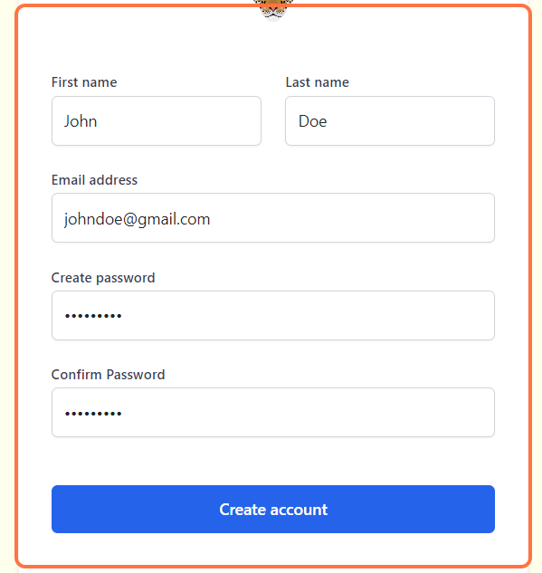
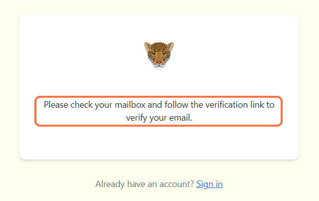
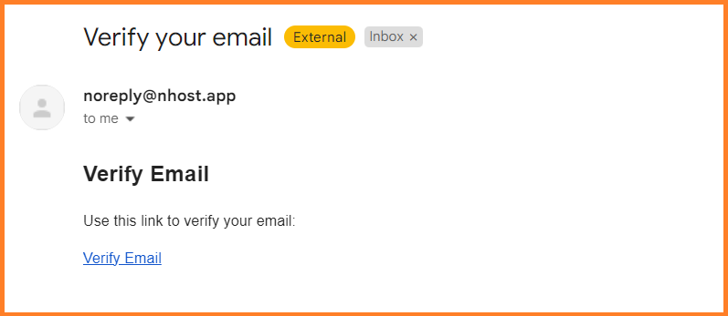
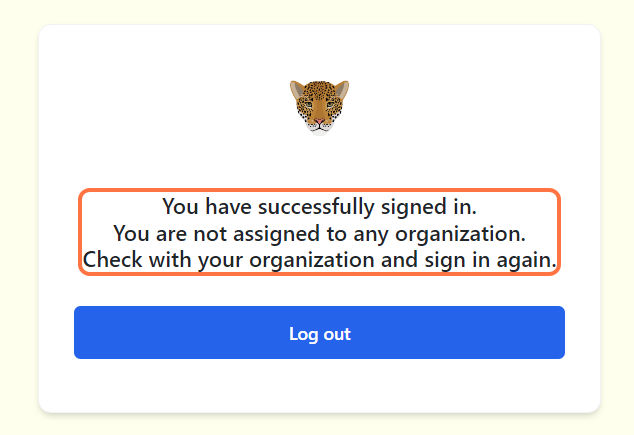

import Title from '@site/src/components/TitleComponent';

# Quick start guide   

<Title/> is a cloud-based platform for managing, analyzing and sharing camera trap data. The platform is full of features and tools to help you process images and derive meaninful insights. If you're just getting started, here's a quick overview of some of the most important things for you to know. 

## Create an account

If you'd like to access all of the tools for managing camera trap data in <Title/>, follow these simple steps to sign up for an account:

- Sign up for an account at [https://belizecameratrap.netlify.app/](https://belizecameratrap.netlify.app/)

**Your credentials should include:** 

- First name
- Last name
- Valid email address 
- Password of at least 9 characters in length

After entering your details, click on the "Create account" button located at the bottom to register your account.

<!-- Picture Here -->
  

### Account Verification

After creating your new account, you will see the message as shown in the image below. All new accounts must be verified. Go to your email, and find the email verification link. It might take some time before it reaches your mail. You might need to check your spam folder or junk mail.

<!-- Picture Here -->

**Verifying your Email**

You should be able see something similar to the image below in your inbox. Remember to check your junk mail if the email doesn't appear.

<!-- Picture Here -->
 

**Successfully signed in**

After verifying your email, you will be successfully signed in. However, at this point, you will not be able to access the system until you are added to a registered organization. Check with your organization's admin. You can logout for now and sign in later when your organization admin adds you. 

<!-- Picture Here -->

## Learn <Title/> Terms
One of the advantages of using <Title/> is that you'll be helping to build one of the largest collections of camera trap data in Belize. A key consideration in building this database is ensuring that all the data submitted to Wild Eyes is standardized. Since Wild Eyes terminology may differ from what you're used to using, we recommend taking a few moments to review key terms used in <Title/>:

- An **organization** is a group or entity with one or more people that share a particular purpose and objectives.
- A **project** is a set of camera deployments within a limited spatial and temporal boundary. Each project has defined objectives and methods.
- A **subproject** is a subset of deployments and/or locations within the same project. Subproject are usually created to differentiate between different areas in a local project (e.g., east side of the river vs. west side of the river, dry season vs wet season) or between larger areas within a project that is set up at a regional scale (e.g. a network of protected areas within a state).
- A **camera check** is a unique spatial and temporal placement of a camera trap device to sample wildlife. For example a camera trap placed at location x,y between January 1-15, 2024 is a different camera check than the same (or different) camera device placed at the same location but between January 1-15, 2023.
- A camera **location** is the physical position in space (UTM format) of a camera trap device.

Visit the <Title/> **[glossary](/docs/glossary)** for additional definitions.

## Structure your projects

Each user in Wildlife Insights is associated with at least one organization and can belong to multiple organizations, and projects. You may be an individual with a few cameras set out on your own property or a data manager at an organization. In any event, thinking through how your data will be managed and shared can help inform how you set up your workspace in Wildlife Insights.

## Upload Data

Once you’ve set up your workspace, you’re ready to start uploading data to <Title/>! There are a few ways to bring your data into the platform.

You may have a collection of images that has not yet been reviewed or catalogued. These images can be uploaded directly into the <Title/> platform. Click on the links below to learn more about the upload process:

- **Upload images** through the <Title/> platform
- **Review your images** in the project “Identify” page

If you have used other software to manage your camera trap data in the past, you can save all your hard work and upload data through:

- Reformatting your data into the **[<Title/> batch upload template](https://docs.google.com/spreadsheets/d/1IOTO1-rlP5XJVvs1DhTMH_Ir7rAp8GW7/edit#gid=519033571)**.