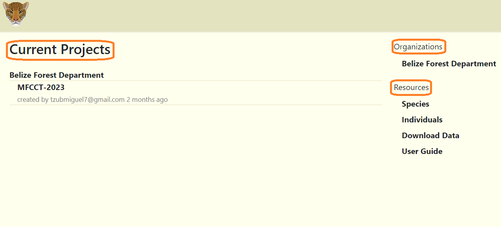
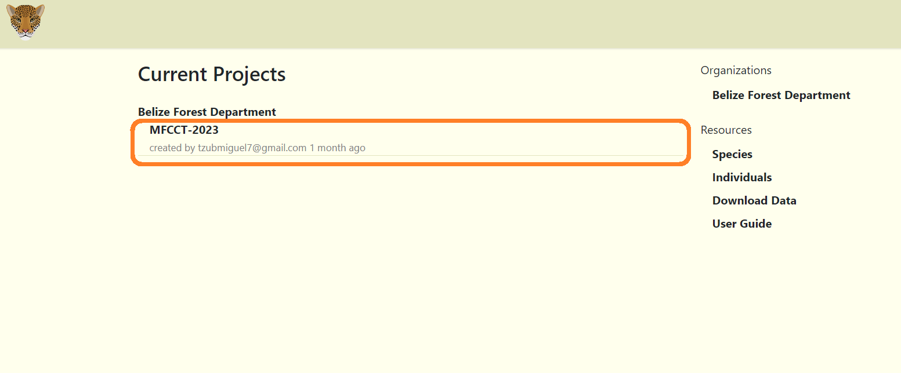

# Homepage
The homepage is the first page you will see after you are added to an organization. It displays current projects, organizations and resources.

## Navigating the Homepage

**Current Projects** displays a list of organizations the user belongs to along with the most recent project. 
**Organizations** displays a list of organizations the user belongs to. Clicking on the organization name, will open the organization workspace listing all the projects.  
**Resources** section is where users can find additional information such as a link to this guide.  

  

***Note:*** *You can also access your project dashboard by clicking on your current project's name. A user will not be able to access the project or the organization workspace if the user is revoked from the project or organization.*
<!-- Picture Here -->
  

 
## View Species
Clicking the "Species" link under resources section will open a page with a list of species that are currently stored in the database. The species details include scientific name, genus, species and common name. The view more details, click on the eye icon under "Actions" column.

## View Individuals
To view Individuals table, click on the "Individuals" link under Resources. This table displays a list of popular or recorded individual animals, such as jaguars or tapirs.
<!-- Picture Here -->

