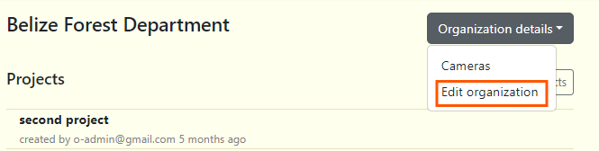

# Organization Overview
Organizations house all of your projects, data and team members in a single place. Within an organization you can create projects.

## Navigating the Organization workspace

**Organization details** button opens a menu with three options to select: Cameras, Locations and Edit organization. 
**Projects** section lists all your projects. Clicking on any of the projects will open the project dashboard.  
**New Projects** button allows you to create a new project.  
**Organization Administrators** section allows you to add users to your organization and displays a list of added members below.

<!-- Picture Here -->

## Edit organization details
**1.** You can add or change organization details by clicking on the **Organization details** button. This can be found on the right side of your organization name. 

**2.** After clicking the button, the menu will open and then select Edit organization option.

**3.** Once your edits have been made, click on Save Changes to save your edits.

## Invite a team member to the organization
To add a team member to your organization, go to the Organization administrator section. Enter your team member’s email, select a role, and click “Add member” button. If your team member has already signed up, you’ll see their name in the permissions list below.

## Revoke a user from an organization
You can revoke any user access to an organization by navigating to the **Organization Administrators** section  and selecting “Revoke” next to user's role. When someone is revoked from an Organization all of the data uploaded by that user will remain in the Organization.

## Create and manage camera details
Wild Eyes requires each camera checks to be associated with a camera. You can manage camera metadata in the Organization workspace. Click on the **Organization details** button, then select **Cameras**. 

Then you will be redirected to page where you can add camera. If there is no information displayed click on the blue "Add New Camera" button. If a table exists click the "Insert" button. Enter all required fields, which are marked with an asterisk. You can edit this information at any time by returning to this page and selecting edit icon under "Actions" column . Visit the **Wild Eyes Glossary** to learn more about the fields in this form.

 

## Create a new project

**To create a new project:**  
**1.** Navigate to the Organization page, click on the grey "New Projects" button which can be found under the Organization details button.  
**2.** After clicking the "New Projects" button, a form will appear.  
  

**3.** Fill out the "New Project" form:

Required fields are marked with an asterisk*
    
    - Project name* - The name assigned to that specific project. ***(Required)***

    - Short name* - A shortened version of the project name. ***(Required)***

    - Project code* - An abbreviation or acronym to represent the project name (no spaces or special characters with the exception of a dash. For example: SIBUN-2024). ***(Required)***

    - Objectives - The outlined goals/tasks of the project. ***(Optional)***

    - Contact Person - The representative/first point of contact for the project. ***(Optional)***

    - Contact email - The primary email of the contact person. ***(Optional)***

    - Project owner/admin - The project creator/owner. ***(Optional)***

    - Project owner/admin email - The primary email of the project creator/owner. ***(Optional)***

    - Start date - The date of which the project was initialized. ***(Optional)***

    - End date - The appointed ending date of the project. ***(Optional)***

**3.** Click the blue "Create Project" button to finalize your changes.

**4.** After clicking the "Create Project" button. If there are no errors, you will be redirected to your project dashboard.

  

***Note:*** *You can also import project data from your project CSV file by clicking the Import data button. The data from your CSV file will fill out the fields in the form. (Remember to check for correct CSV format).*

## Navigate to Home Page

**To quickly navigate to your Home page:**

**1.** Click on the logo located on the top right corner of the header. You can click on the organization name to navigate to the Organization page as well.

<!-- Picture Here -->
