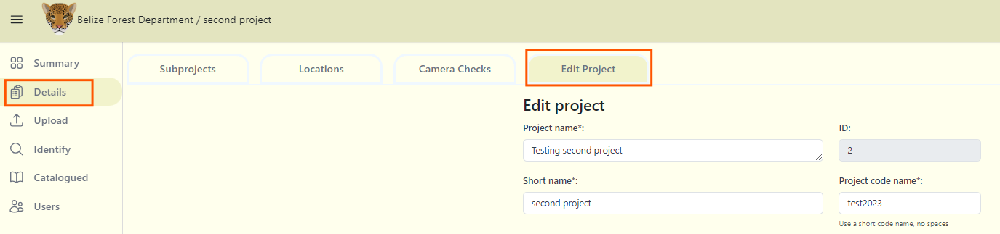
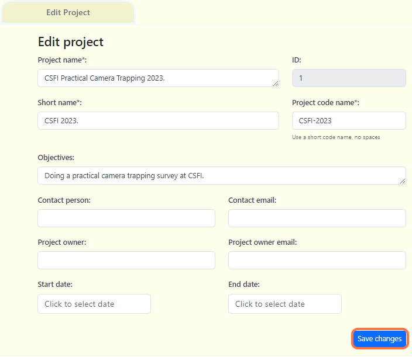

import Title from '@site/src/components/TitleComponent';

# Project Overview

Whenever you upload data to <Title/>, it will be associated with a project. A project consists of one or more camera deployments that share a specific objective and methodology. In <Title/>, the project dashboard allows you to manage, edit, and review metadata related to deployments, and images. 

## Navigating the project dashboard
**Summary** tab: The project summary tab displays an overview of the data within that project.  
**Details** tab:  This is where you can set and edit project details including the objectives, start and end date. This is also where you can add and edit Subprojects, Locations and Camera Checks information (required fields).  
**Upload** tab: In this tab, you can upload images belonging to the project. Images are uploaded per camera checks.  
**Identify** tab: Images upload to the project will appear in this tab. These images can be filterd by location, camera checks, species and subprojects.  
**Catalogued** tab: All data that has been reviewed by a user will be stored in this section.  
**Users** tab: This button will open a screen where you can add users to your project.  

## Edit a project

**To edit your project details:**  
**1.** Navigate to your project dashboard, and click on the "Details" tab.  
**2.** Select the "Edit Project" tab.

***3.*** Once your edits have been made, click on Save Changes to save your edits.

<!-- Picture Here -->

## Create camera checks
You can create new camera checks at any time in the details tab (make sure you are in the project dashboard):
1. Click on the *Details* tab
2. Click on the *Camera Checks* tab that appears on the right side of the screen.
3. Click on the "New camera checks" button or the insert button.

***Note***: *to edit, click the edit icon under the Actions column and next to the record you want to change.*

## Join an existing project
You must be invited by a Project Admin or Editor to join an existing project.

## Invite someone to join your Project
When you're on the project dashboard, you can add users by clicking the Users tab on the left side of the screen. This will display a "Project Users" page where you can add users by entering their email addresses. You can assign one of five roles at the project level: Admin, Editor, Contributor, Tagger, or Viewer. There is no limit to the number of users you can add to your project. Users must be signed in before they can be added.

## Remove a team member from a project
You can revoke any user's access to a project by clicking User tab and selecting “Revoke” next to user's role. When someone is revoked from a project all of the data uploaded by that user will remain in the project. You can unrevoke any user's access to a project at any time.