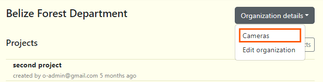

# Cameras
A camera is the physical device used to capture images. Since cameras can be used across multiple projects, their details are managed on the Organization workspace. This allows any camera within an organization to be linked to any deployment in any project.

## Create a camera in Organization workspace
You can also create a camera in the organization workspace:
  1. Navigate to organization workspace
  2. Click on the Organization details button
  3. Select Cameras on the menu  
  

3. Click insert and fill out the "Add new Camera" form.
    - Camera name* - The unique name assigned to that specific camera. ***(Required)***
    - Make - The company which manufactured the camera (Example: Bushnell). ***(Optional)*** 
    - Model - The camera's specific model/code (Example: 119987C). ***(Optional)***
    - Serial number - The camera's given serial number. ***(Optional)***
    - Purchase date - The purchase date of the camera. ***(Optional)***
    - Purchase price - The purchase price of the camera. ***(Optional)***
    - Product URL - The link to where the camera can be found. ***(Optional)***
    - Number of batteries - The number of batteries needed for the camera. ***(Optional)***
    - Status* - The current status of the camera (Can either be: Active, Available, Lost, Retired, Stolen). ***(Required)***
    - Remarks - Additional notes about the product/camera. ***(Optional)***  

4. Click the blue "Create" button to finalize your changes.

     

## Edit an existing camera
To edit an existing camera, click the green edit icon to the right of any camera record under "Actions "column. Once your edits have been made, click on Save Changes to save your edits.

## Search for a camera
Search for a camera by name by typing in criteria in the search box in the left hand corner of the camera table.

## Sort cameras
Click on the column name to sort in ascending or descending order. The column that is being used to sort cameras will display a blue arrow next to the column header.

## Bulk camera check uploads
You can easily create multiple cameras by uploading a CSV template with the necessary information. Start by recording camera details in a blank template. Click on the "Download CSV Template" button to download a blank camera check template to get started. 

Before you upload a bulk camera template, please remember to:
- Enter values for all required fields in the template
- If a default value is noted, please enter the default value even if the field is not required.
- The file must be a csv file.
- Check **[camera template guide](https://docs.google.com/spreadsheets/d/1IOTO1-rlP5XJVvs1DhTMH_Ir7rAp8GW7/edit#gid=544522265)** for full details.

To upload your CSV file:

1. Click on the "Import CSV" button.
2. Select the CSV file that has the camera details.
3. Then click the "Submit import data" link that appears next to the "Import CSV" button to upload.

<!-- Picture Here -->
  
