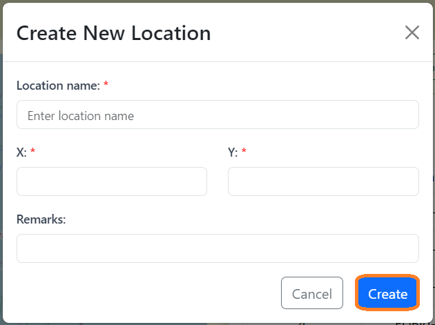
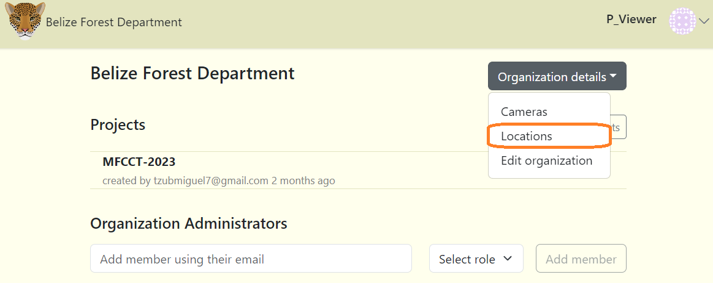
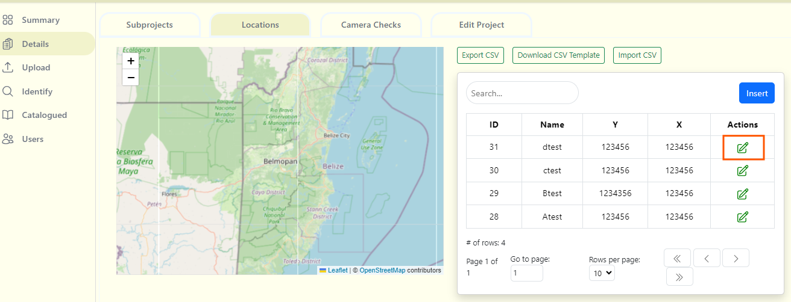

# Locations

A location is the physical position (UTM format) of a camera trap device. In projects with multi-year sampling efforts, a location may be linked to multiple camera checks.

## Create a location in Project Dashboard
To create a location in Project Dashboard:

1. Click on the "Locations" tab

2. Click on the blue "Add New Camera" button or the "Insert" button. 

3. Fill out the "Create New Location" form. Required fields are marked with an asterisk*   
    - Location name* - A unique location name. ***(Required)***
    - X* - The X coordinates for the location (Must be in UTM format). ***(Required)***
    - Y* - The Y coordinates for the location (Must be in UTM format). ***(Required)***
    - Remarks - Additional notes about the location. ***(Optional)***

4. Click the blue "Create" button to finalize your changes.

<!-- Picture Here -->

## Create a location in the Organization workspace

To create a location in the Organization workspace:

1. Navigate to the Organization workspace

2. Click on the "Organization details" button.

3. Then select "Locations".

4. Click on the blue "Add New Camera" button or the "Insert" button.

5. Fill out the "Create New Location" form. Required fields are marked with an asterisk*

6. Click the blue "Create" button to finalize your changes.

## Edit an existing location
To edit an existing location:

1. Click the green edit icon button to the right of any location record.

2. Once your edits have been made, click on Save Changes to save your edits.

## Search for a location
Search for a location by name by typing in criteria in the search box in the left hand corner of the location table.

## Sort locations
Click on the column name to sort in ascending or descending order. The column that is being used to sort locations will display a blue arrow next to the column header.