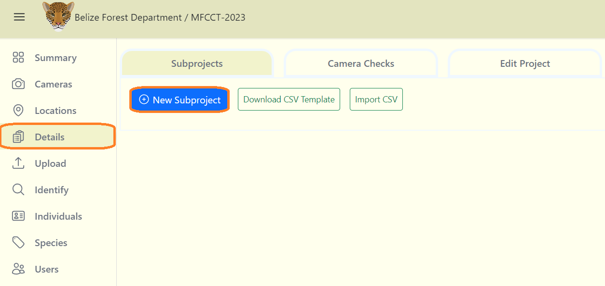
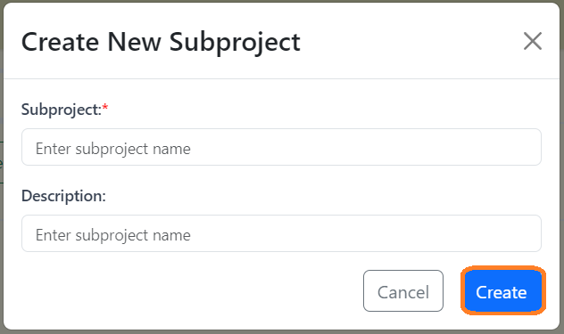
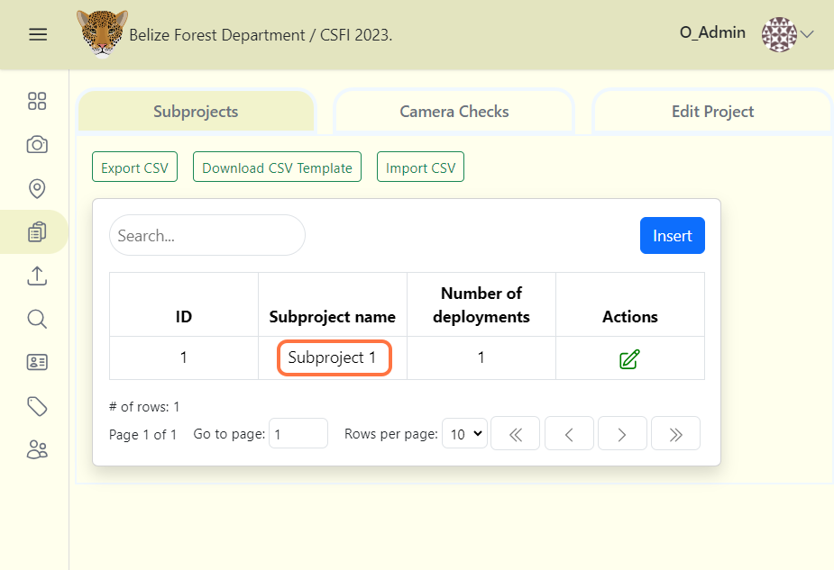
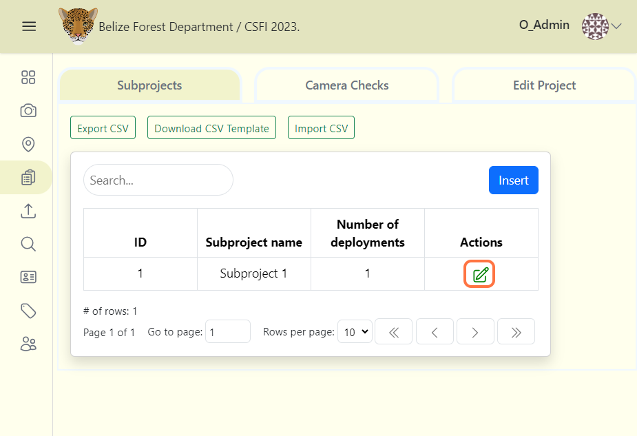

# Subprojects
A subproject is a grouping of camera checks, organized to suit your team's workflow. TFor instance, you can use subprojects to group deployments by spatial divisions. 

## Create a Subproject

A Subproject can be created similar to how you create camera or location details:

1. From your project dashboard, navigate to the "Details" tab and then click on the "Subprojects" tab.

2. Click on the "Add New Subproject" button or the "Insert" button.

3. After clicking the "Insert" button, a form will appear.

4. Fill out the "Create New Subproject" form (Required fields are marked with an asterik*)
    
    - Subproject* - The assigned name for the subproject. ***(Required)***

    - Description - A short paragaph describing the purpose of the subproject. ***(Optional)***

5. Click the blue "Create" button to finalize your changes.

## View camera checks within a subproject
To view all of the camera checks within a subproject:

1. Navigate to the subprojects table in Details tab.

2. Click on the name of the subproject in the Subproject Name column.

3. A screen will open displaying the camera checks assigned to that subproject. You can sort and search through camera checks in this table.
  

## Edit an existing Subproject
To edit an existing Subproject:

1. Click the green edit icon to the right of any subproject record. 

2. Once your edits have been made, click on Save Changes to save your edits.

## Search for a subproject
Search for a subproject by name by typing in the search box in the left hand corner of the subproject table.

## Sort subprojects
Click on the column name to sort in ascending or descending order. The column that is being used to sort suprojects will display a blue arrow next to the column header.