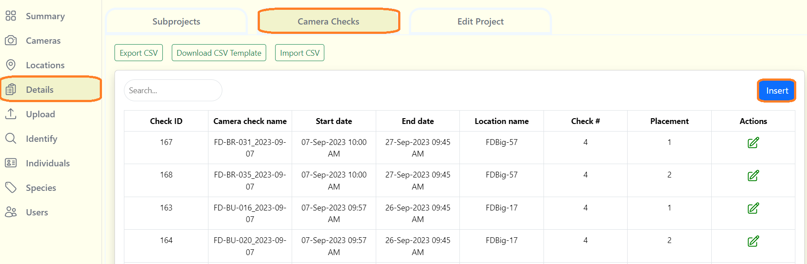
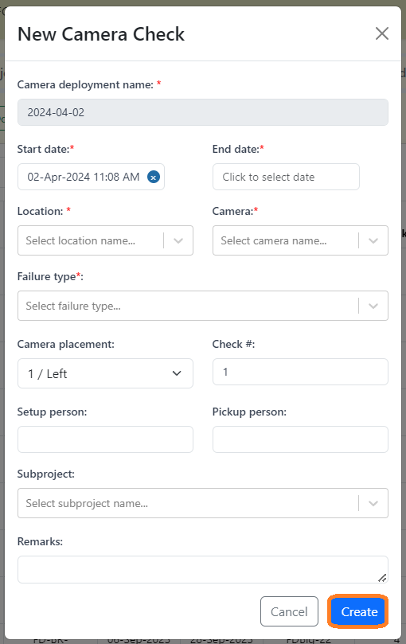
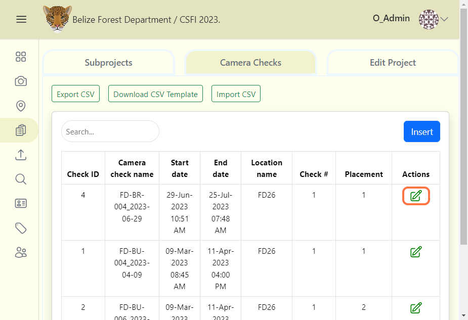
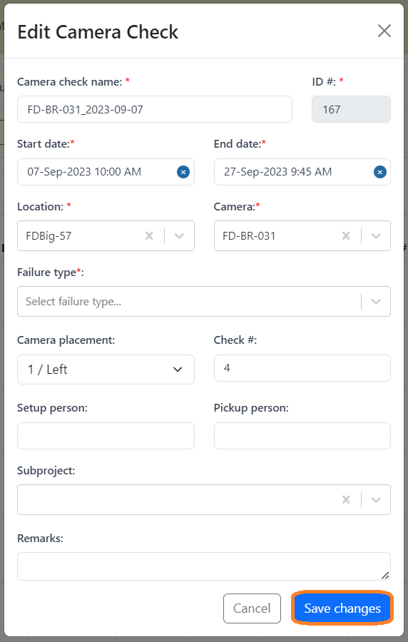
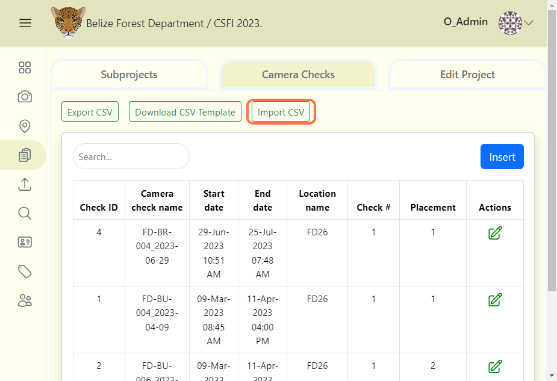

# Camera Checks 
The extraction of data from a single camera positioned at a designated location (x, y) for a defined duration. Multiple camera checks can be associated with a single location.

## Create a Camera Check
***Note:*** *Before creating a new camera check, you must enter all your camera, and location details prior.* 

Camera checks can be created similar to how you create camera or location details:

1. From your project dashboard, navigate to the "Details" tab 
2. Click on the "Camera Checks" tab.
3. Click on the blue "Add New Camera" button or the "Insert" button.

4. Fill out the "Create New Camera Check" form

    Required fields are marked with an asterik*
    
    - Camera check name* - Automated camera name given by the system (Corresponds with the start date, can be adjusted by editing the start date). ***(Required)***

    - Start date* - The date and time of which the camera check was initialized. Can also mean the date and time when the sd card is installed. ***(Required)***

    - End date* - The predetermined ending date and time of the camera check's usage or the retrieval of the sd card. ***(Required)***

    - Location* - The location where the camera check is being recorded from. ***(Required)***

    - Camera* - The assigned camera name which the check will be performed on. ***(Required)***

    - Failure type* - The reason for the camera's failure/absence (Can either be: Camera Functioning, Camera Hardware Failure, Memory Card Failure, Unkown Failure, Vandalism, Theft, Wildlife Damage). ***(Required)***

    - Camera placement - The assigned placement of the cameras. ***(Optional)***

    - Check # - The number of check's that have been performed. ***(Optional)***

    - Setup person - The person who was assigned to setup the camera check. ***(Optional)***

    - Pickup person - The person who was assigned to picking up the camera check. ***(Optional)***

    - Subproject - Any subproject's which are related to the camera check. ***(Optional)***

    - Remarks - Additional notes about the camera check. ***(Optional)***

5. Click the blue "Create" button to finalize your changes.  
 

## Edit an existing camera check
To edit an existing camera check:

1. Click the green edit icon to the right of any camera check record.  

2. Once your edits have been made, click on Save Changes to save your edits.  

## Search for a camera check
Search for a camera check by name by typing in the search box in the left hand corner of the camera check table.

## Sort camera checks
Click on the column name to sort in ascending or descending order. The column that is being used to sort camera checks will display a blue arrow next to the column header.

## Bulk camera check uploads
You can easily create multiple camera checks by uploading a CSV template with the necessary information. Start by recording camera check details in a blank template as you set up cameras. Download a blank camera check template to get started. 

Before you upload a bulk camera check template, please remember to:
- Enter values for all required fields in the template
- If a default value is noted, please enter the default value even if the field is not required.
- Check **[camera check template guide](https://docs.google.com/spreadsheets/d/1IOTO1-rlP5XJVvs1DhTMH_Ir7rAp8GW7/edit#gid=908943824)** for full details.

To upload your data:

1. Click on the Import CSV button.
2. Then select your CSV file containing the camera check data.
3. Then click the "Submit import data" link that appears next to the "Import CSV" button to upload.

<!-- Picture Here -->
 