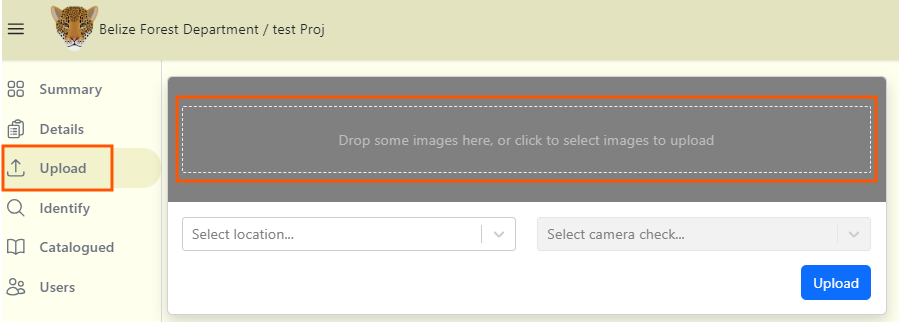
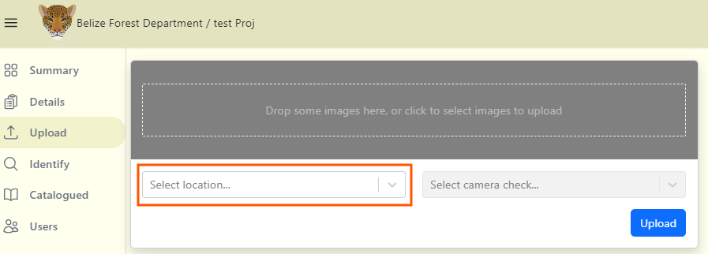
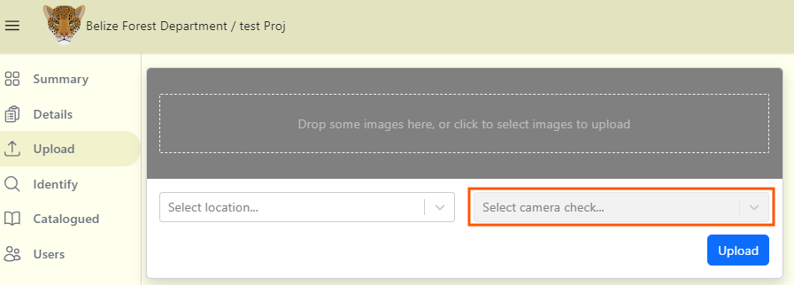
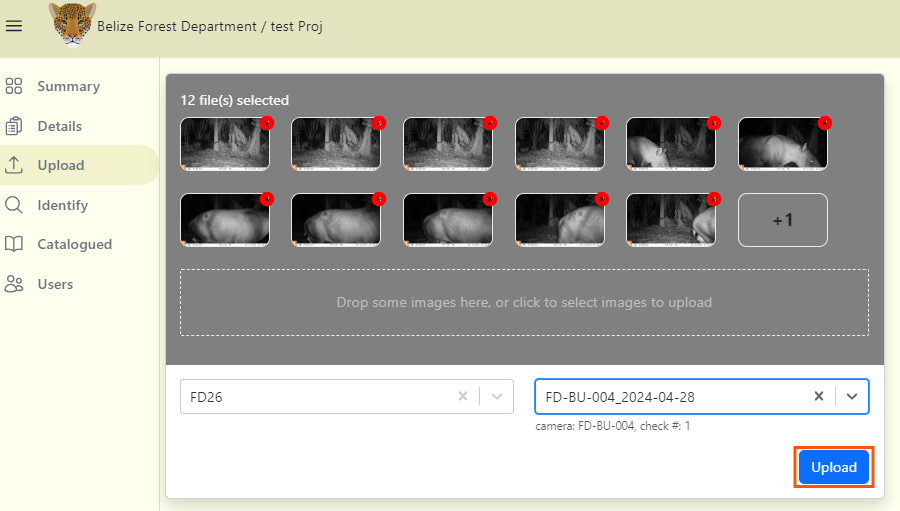
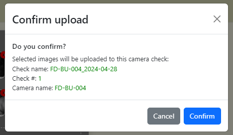

# Upload Images

## Uploading images to Wild Eyes
Images are linked to their respective camera checks. You can begin uploading by:

1. From your project dashboard, navigate to the "Upload" tab.
2. Select your images by clicking in the white box area with a dashed-line border or drag your images to this area.
  

3. Select the location where the images were taken. Selecting location helps filter out camera check names that belong only to the selected location.
  

4. Then select the specific camera check name that the images belong to. It is important that the location and camera check details were already added so that images can be linked properly.
  

5. Click on the blue "Upload" button. In an attempt to ensure that the correct camera check name is selected, a confirmation box will be displayed.
  

6. Click on the blue "Confirm" button after checking that you selected the correct camera check.
  

7. Upload progress will be shown in a notification at the top of the screen. Please wait until all images are uploaded before moving to another page.

8. You can then go to the Identify page to view your uploaded images after completion.

<!-- Picture Here -->

