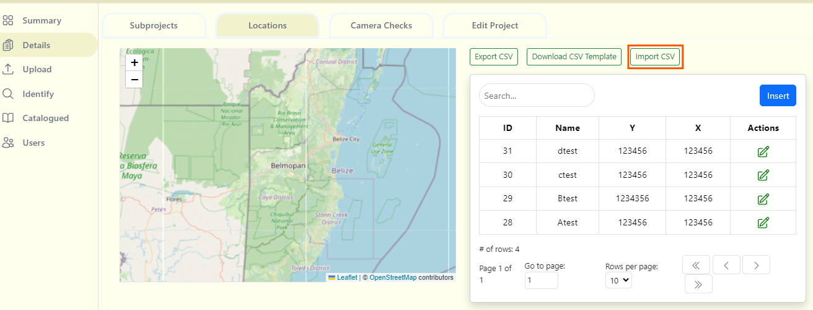
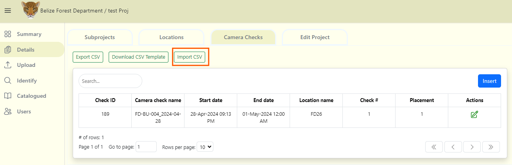
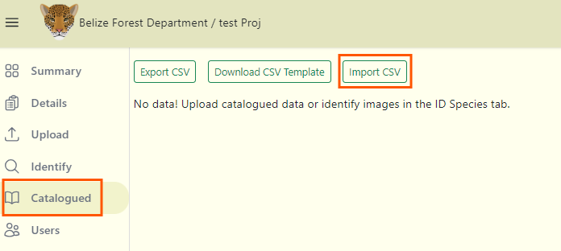

import Title from '@site/src/components/TitleComponent';

# Bulk data uploads
You can bring your catalogued data into <Title/>.

## 1. Download the batch upload templates
To batch upload your catalouged data into <Title/>, ensure your data is formatted according to the batch upload template. You will need six templates for a complete batch upload: one each for Project, Camera, Location, Subproject, Camera Check and Image .csv files. To begin migrating your data, download a blank **[batch upload template](https://drive.google.com/drive/folders/12eqhTxTVB35ex1-EFBrUGaBV6gid8Eju)**.

## 2. Complete the templates with your data
Enter your data into each template, ensuring you refer to the **[Batch Upload Guide](https://docs.google.com/spreadsheets/d/1IOTO1-rlP5XJVvs1DhTMH_Ir7rAp8GW7/edit#gid=519033571)** for default values, accepted formats, and required fields. Here are some important steps and recommendations:

- **Map Species Names:** Ensure scientific or common names used in your project are mapped to the Wild Eyes taxonomy list before bulk uploading. The Species ID is required for each image and populates species_id field in the images_template.csv file. 
- **File Naming Conventions:** Avoid spaces and special characters (hyphens and underscores are OK) in your file names. The images_template.csv includes fields for image filenames. Follow best practices by avoiding spaces and special characters in these fields.
- **Non-Required Fields:** Leave non-required fields blank if they are not applicable to your project. Do not enter "NA" or "None." For example, if your project does not use subprojects, leave the subproject_name field blank in the cameraCheck_template.csv.
- **Separate Files for Multiple Projects:** Create separate files for each project. If you are batch uploading multiple projects, create separate files for each template. For instance, for two projects, you will have 12 (subproject.csv are optional) files in total: 2 project.csv files, 2 cameraCheck.csv files, 2 camera.csv files, 2 location.csv and 2 images.csv files and 2 subproject.csv files.
- **Save as .csv:** Save your completed templates as .csv files, not Excel files, to preserve date/time formats and trailing zeros.

## 3. Create a new project
You can import your project.csv file to automatically populate your form.

## 4. Bulk upload cameras
To upload your camera.csv file:

1. Click on the "Import CSV" button.
2. Select the CSV file that has the camera details.
3. Then click the "Submit import data" link that appears next to the "Import CSV" button to upload.

<!-- Picture Here -->
 

## 5. Bulk upload locations
To upload your location.csv file:

1. Click on the "Import CSV" button.
2. Select the CSV file that has the location details.
3. Then click the "Submit import data" link that appears next to the "Import CSV" button to upload.

<!-- Picture Here -->

## 6. Bulk upload camera checks
To upload your camera-check.csv file:

1. Click on the Import CSV button.
2. Then select your CSV file containing the camera check data.
3. Then click the "Submit import data" link that appears next to the "Import CSV" button to upload.

<!-- Picture Here -->
 

## 7. Upload images
Refer to **[upload images](/docs/upload/upload-images)** page on how to upload your images.

## 8. Bulk upload catalogued data

If images uploaded in the **Identify** page have already been identified, organize your data in a CSV file using the correct format. Please refer to the **[<Title/> Batch upload guide](https://drive.google.com/drive/folders/14IctEBIenhSC7duImD5uH_f575h3rMwO)** (image_template.csv) for detailed instruction on how to upload your **image metadata**. 

To upload your catalogued data (image.csv):

1. Click on Import CSV button.
2. Select your file.
3. Click on the blue Submit import data link next to the Import CSV button.
4. If there are no errors, you should then be able to see a success notification and a table with your data will appear below. Review that your images are identified correctly, by navigating to the **Identify** page.

***Note:*** *Report any issues encountered.*

<!-- Picture Here -->

