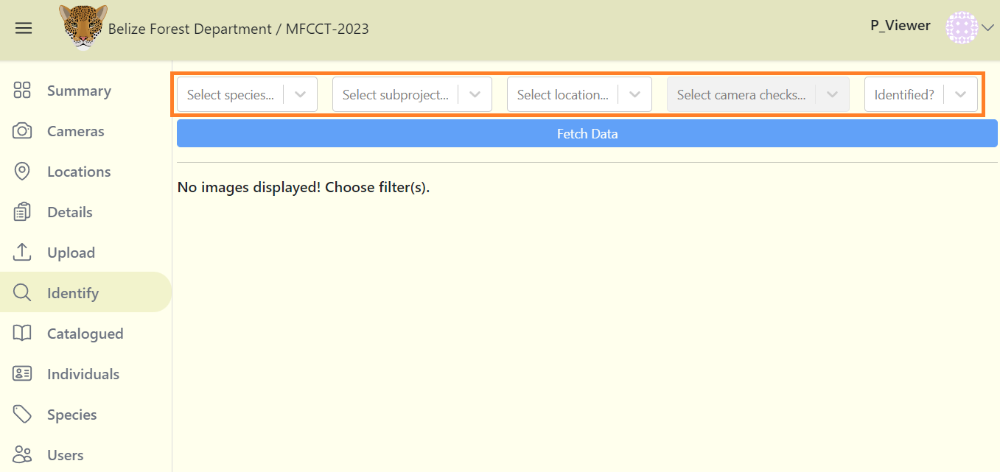
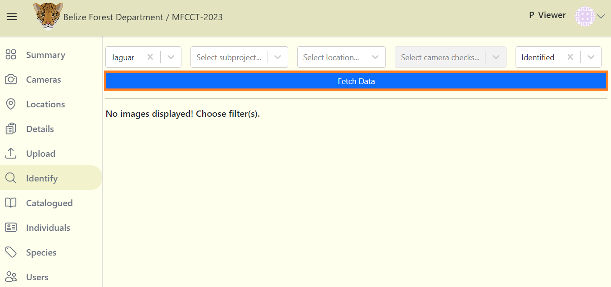
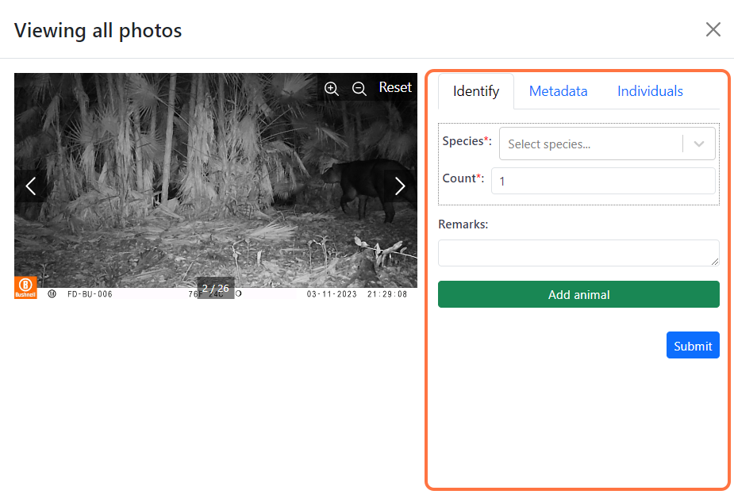
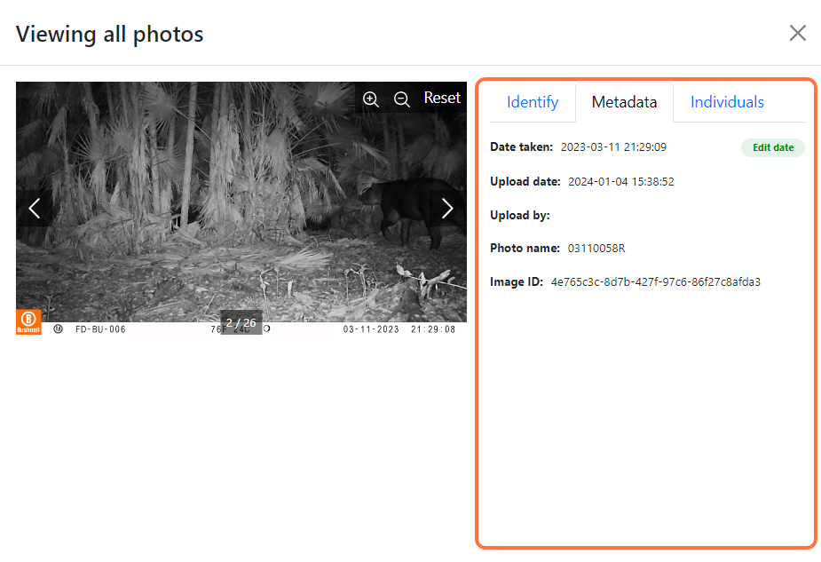
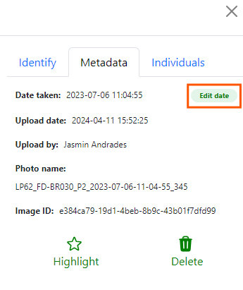
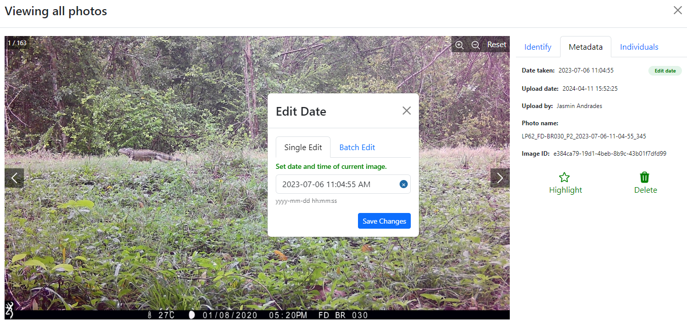
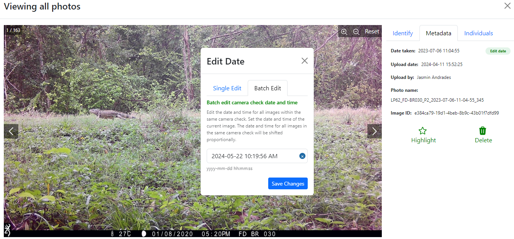
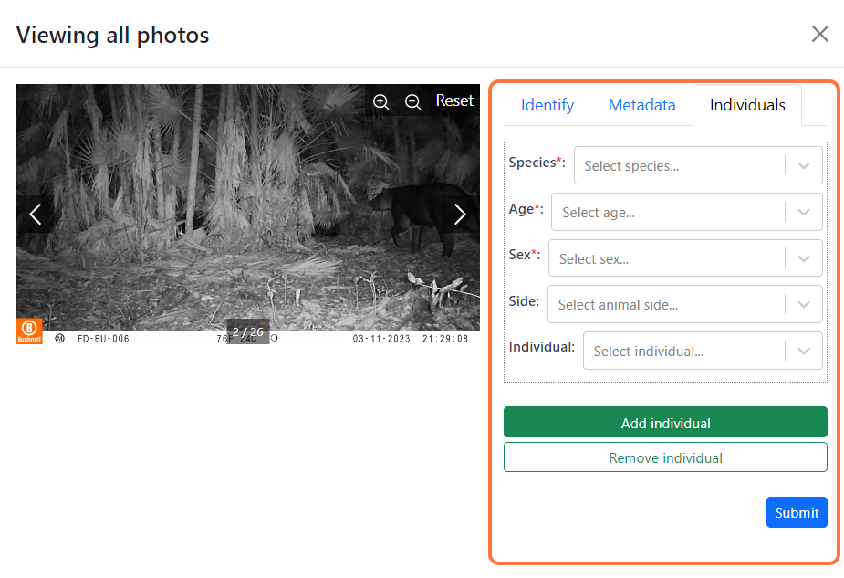
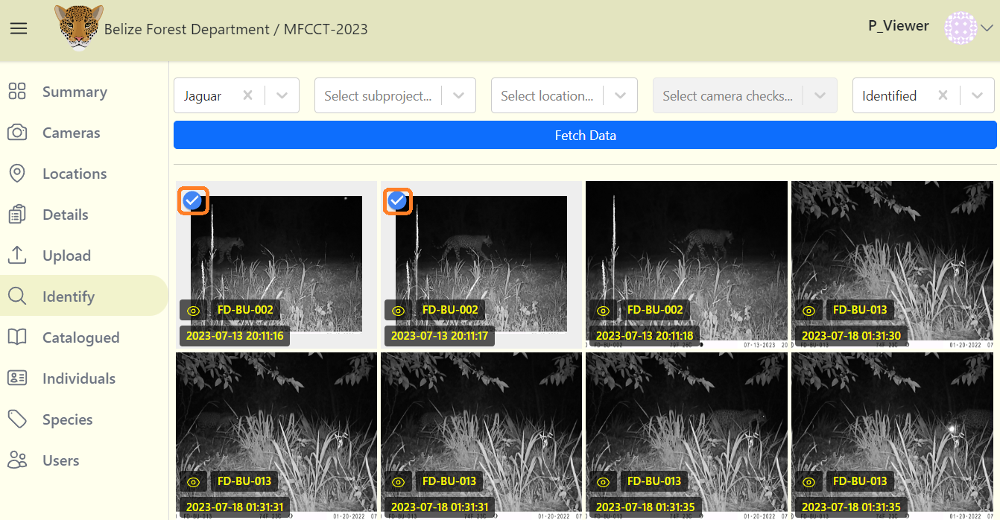
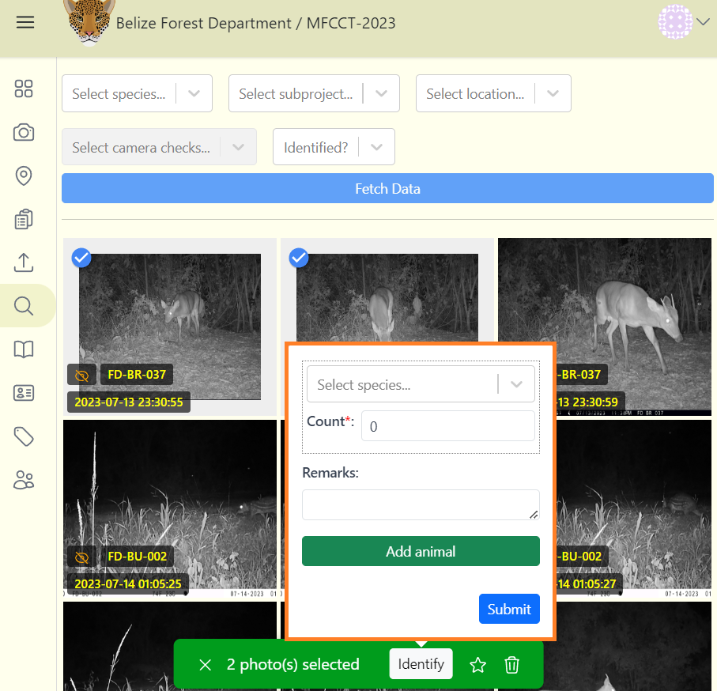

# Image Identifications

## Select filter options

1. Navigate to the Identify tab to access your project images.

2. Filters make it easy to focus on a smaller subset of images. You can filter images with these options:
    - **Species** 
    - **Subprojects** 
    - **Locations** 
    - **Camera checks**: The camera check option is enabled after selecting a location name.
    - **Identified**: You can also filter indentified or unidentified images.
    
    

3. After selecting your filter options, click on the blue "Fetch Data" button to retrieve image and its metadata.
    

## Add or edit identifications

1. Click on the thumbnail preview (don't click on the circular checkbox on the top left). A screen will open displaying a larger preview of the image. To the right of the image, under Identify tab, you will see:
    - **Species**
    - **Count:** the number of objects(people or animals) per species seen in the picture.
    - **Remarks**
    - **Add animal** button: You can add another species in case there are more than one species in the image.

    

2. The Species field will be empty if the image is not yet identified. Fill out the species identication form. Then click the blue **Submit** button. If the image is already identified, then you can edit in this same form and save your changes.

## Image Metadata
Navigate to the Metadata tab  of any individual image. It displays the following: 
    - **Date taken**:  image time capture in 24 hour format (yyyy-mm-dd HH-mm-ss).  
    - **Upload date**: date the image is uploaded to the platform in 24 hour format (yyyy-mm-dd HH-mm-ss).
    - **Uploaded by**: The name of the person who identified the image.
    - **Photo name**: The unique name of the image assigned prior to upload.
    - **Image ID**:  The unique ID assigned to each image uploaded.  
<!-- Picture Here -->
      

## Update the date and time
You can fix incorrect date/time stamps caused by camera failures or metadata issues. Navigate to the metadata tab of any individual image and click on green **Edit date** button on the top right corner.

     

A dialogue box will appear and display two tabs:
    - **Single Edit**: The new date/time will be applied to the image displayed only.
     

    - **Batch edit**:  The new date/time will be applied to the image displayed AND the timestamps of all other images within the same camera check will shift proportionally.
     

## Higlight an image
When viewing an image in large preview mode, you can easily flag it as a favorite for quick access later. In the identification panel, click the Star icon above the word "Highlight" to mark the image.

## Add individuals
Navigate to the *Individuals* tab of any individual image to add specific individual data. The form consists of five fields:

    - **Species**: Contains the species list, which is linked to the species identified in *Identify* tab.
    - **Age**
    - **Sex**
    - **Side**
    - **Individual**: standardized name of a jaguar

    ***Note:*** *The number entered in the count field during species identification will determine how many individuals can be added.*  

<!-- Picture Here -->

## Bulk identifications
1. Quickly select multiple images in the thumbnail view by clicking on the circle check mark on the top left corner of the image. 
    
      

2. A green bar with additional actions will appear at the bottom center of the screen:
    - View the number of images selected
    - Click the *Identify* button to assign an identification to all images selected. (If at least one identified image is among the selected images, the *Identify* button will be disabled).
    - You can also highlight selected images by clicking on the star icon
    - The selected images can also be deleted. Exercise caution when deleting images (all image metadata, including the image will be permanently deleted).
    - Click the X icon to deselect the selected images

     