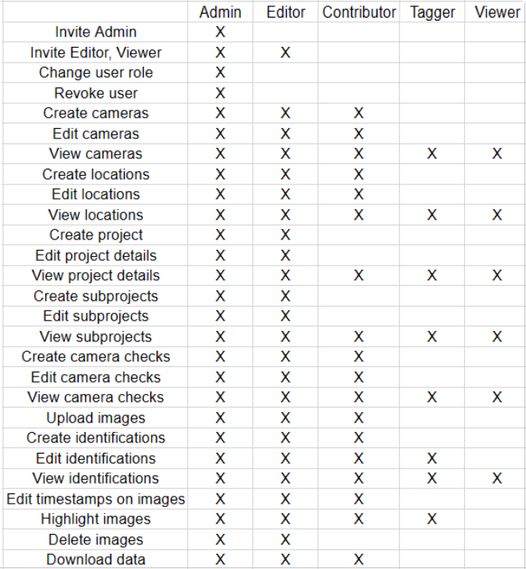

# Add your team

## Add your team to your Organization or Project
Before a user can access your organization or project, they must sign up and verify their email address. Then you can add them to your organization or project by:

1. Navigating to the organization workspace or project dashboard that you want to add members to. 
    - If you are in the Organization workspace, scroll to the Organization Administrators section. 
     
    - If you are in the Project dashboard, click *Users* tab
    
2. Enter the user's email address and assign them a role. See below for more details on roles and permissions.
3. The role selected will apply only to the entity that you're adding them to. For example, if you are on a specific project dashboard, the user added will be given access only to that project.
 

## Organization Roles

Organization roles are listed and described below:
    - Organization admin: Has full editing and viewing permissions. Can invite or revoke permision of any organization or project user. Has inherited an Admin role in all projects in the organization.
    - Organization editor: Has full editing and viewing permissions. Can invite Organization Viewers. Has inherited Organization Viewer role.
    - Organization viewer: Can view all data and details in the organization but cannot edit anything. Has and inherited Viewer role in all projects within the organization

Below is a table illustrating the  specific permissions of each role (if access is allowed it will be marked with an "X")
    

## Project Roles

A brief description of each role is described below:
    - Project admin: Has full editing and viewing permissions. Can invite and revoke permisions of any project user.
    - Project editor: Has full editing and viewing permisions within the project.
    - Project contributor: Can identify images, create camera checks and upload images.
    - Project tagger: Can edit identifications
    - Project viewer: Can view all data and details in the project but cannot edit anything.

Below is a table illustrating the specific permissions of each role (if access is allowed it will be marked with an "X")
    

## Inherited roles

Below is a chart displaying the inheritance between each of the organization and project roles:

