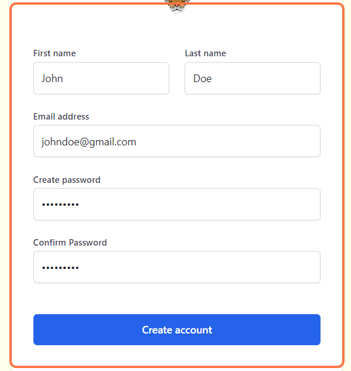

# Creating an Account   

## Sign-in  

***Note:*** First time users must sign up before they are allowed to use the system; to do that, you must click on "Sign up" located at the bottom of the page. However, if you already have an account registered, feel free to sign in by entering your credentials.

<!-- Picture Here -->
  

## Credentials

**Your credentials should include:** 

- First name
- Last name
- Valid email address 
- Password of at least 9 characters in length

After entering your details, click on the "Create account" button located at the bottom to register your account.

<!-- Picture Here -->
  

## Account Verification

After creating your new account, you will see the message as shown in the image below. All new accounts must be verified. Go to your email, and find the email verification link. It might take some time before it reaches your mail. You might need to check your spam folder or junk mail.

<!-- Picture Here -->

## Verifying your Email

You should be able see something similar to the image below in your inbox. Remember to check your junk mail if the email doesn't appear.

<!-- Picture Here -->
 

## Successfully signed in

After verifying your email, you will be successfully signed in. However, at this point, you will not be able to access the system until you are added to a registered organization. Check with your organization's admin. You can logout for now and sign in later when your organization admin adds you. 

<!-- Picture Here -->

