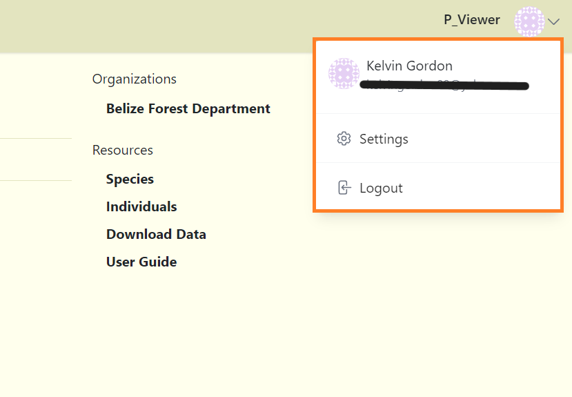
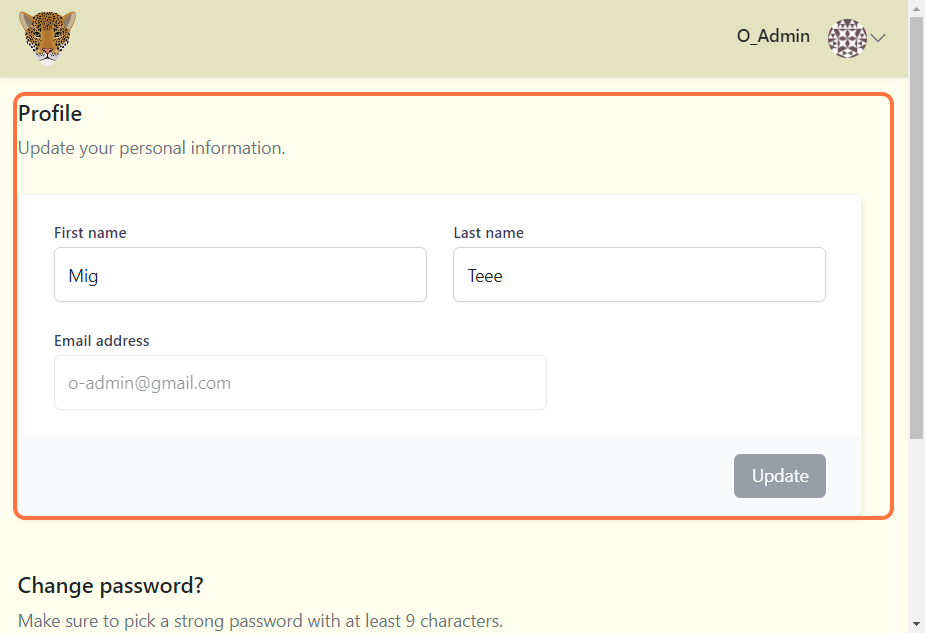
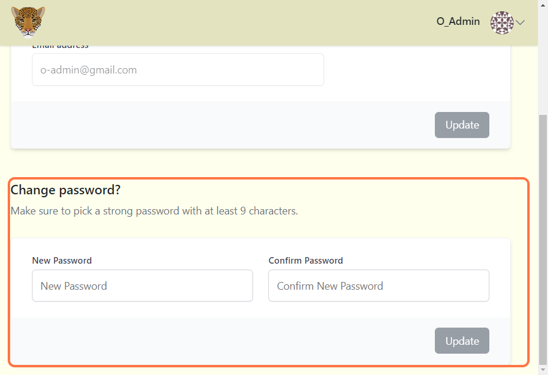

# Settings  

## Locating profile settings

**To locate your profile settings:**

**1.** Click on your avatar on the top right corner. 

<!-- Picture Here -->

## Update profile details

**To update your profile:**

**1.** Select "Settings" and navigate to the Profile section.

**2.** Update your credentials (First name, Last name, Email address).

**3.** Click the update button to save your changes.

<!-- Picture Here -->

## Change password

**To change your password:**

**1.** Select "Settings" and navigate to the Change password section.

**2.** Update your password.

**3.** Click the update button to save your changes.

<!-- Picture Here -->

