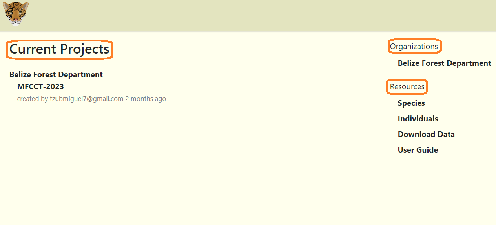
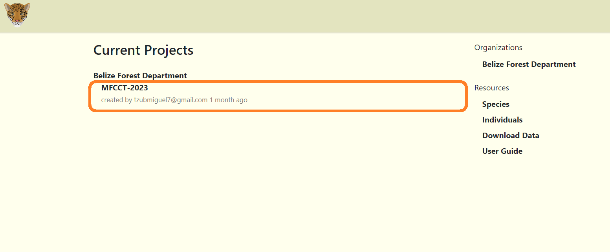
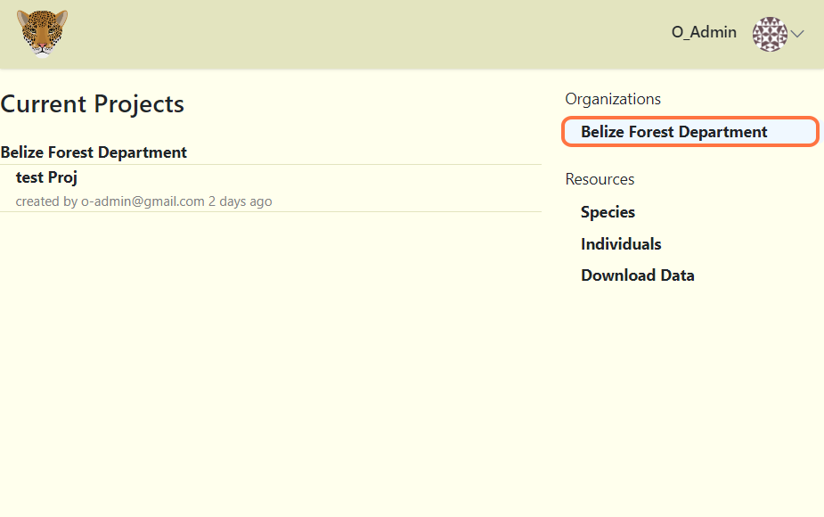
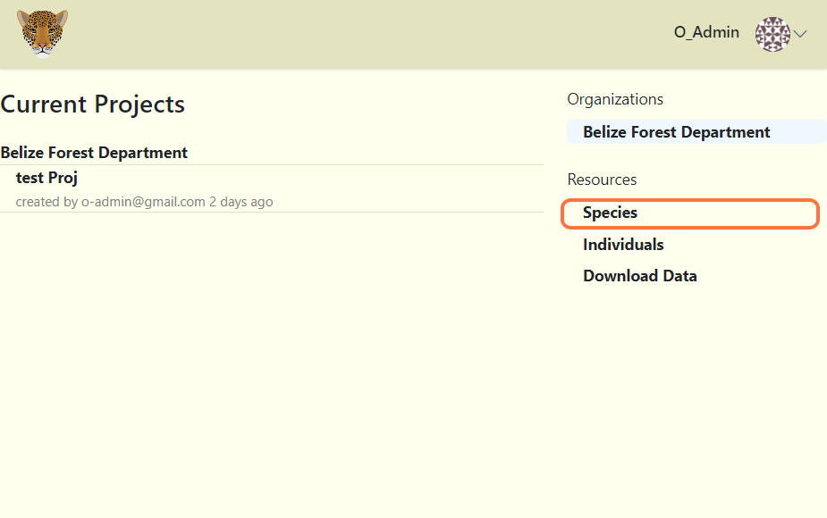
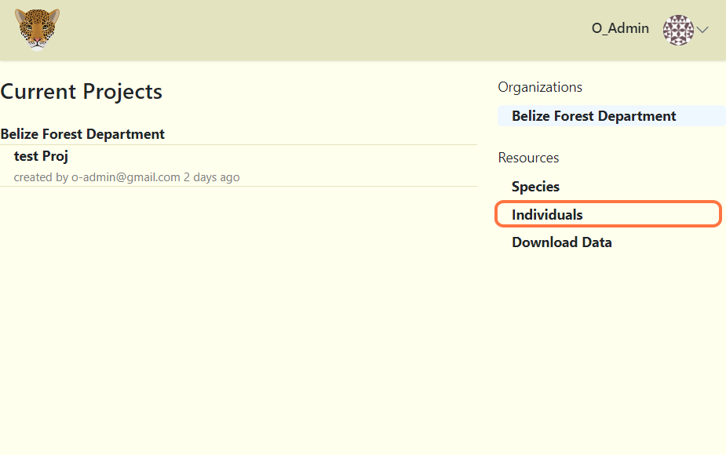
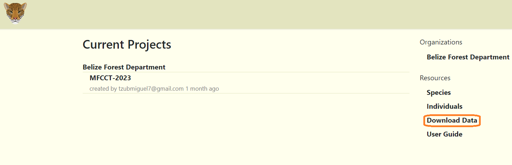

# Overview

##  Page Layout 
**When first entering the home page you should be met with a few menus, those being:**

- **Current Projects**  
- **Organizations**  
- **Resources**  

  

## Current Projects

- Here you will find the most recent projects created. To view additional projects, you will need to click on the organization's name. 

***Note:*** You can also access your project dashboard by clicking on your current project's name.
<!-- Picture Here -->
  

 

## Organizations  

- This is where your organization's name will be found.

<!-- Picture Here -->
  
**[Learn more about the Organization Page](../tutorial-organizations/organization.md)** 

## Resources:

- Here you will find the species, individuals and download data tools.

### Species

- Displays a table of all known (recorded) species.

<!-- Picture Here -->
  

### Individuals

- Contains images of known (recorded) individuals (jaguars, tapir and other identified individuals).
<!-- Picture Here -->

### Download Data

- A tool for exporting project data from a specific time period.

<!-- Picture Here -->  

**[Learn more about the resources](resources.md)**
