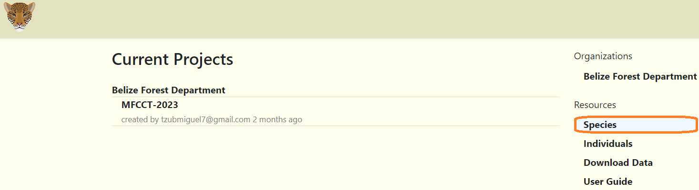
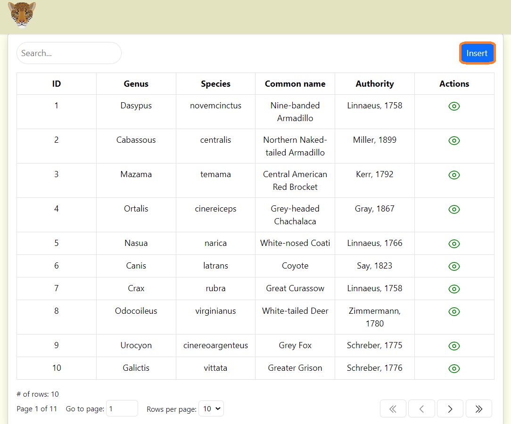
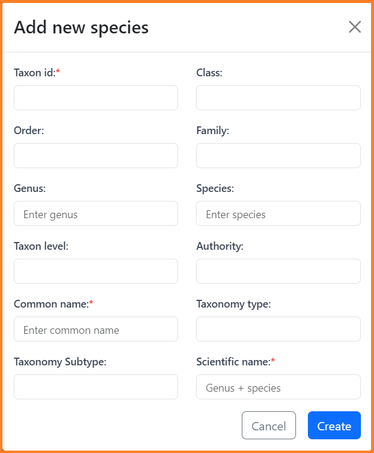
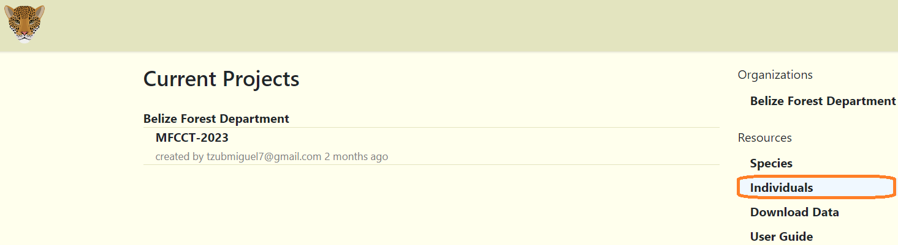
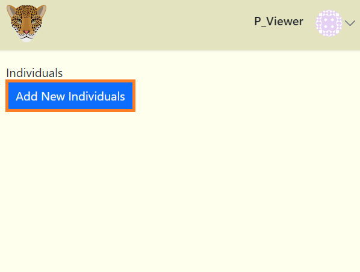
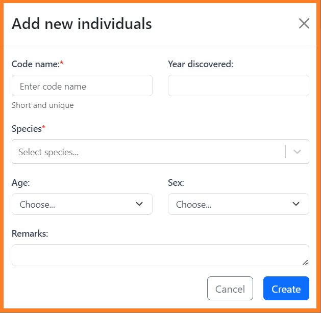
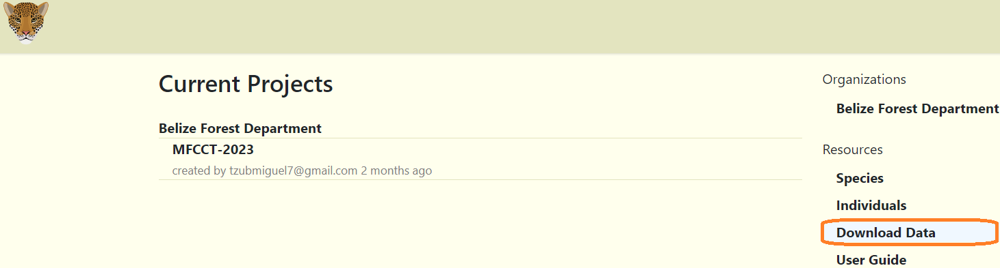
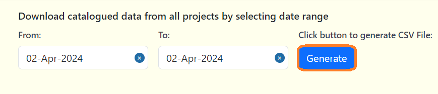

# Navigating Resources   

## Species Table

**To navigate to the Species table:**

**1.** Click on the "Species" link under the Resources section within the Home page. 

**2.** A new species can be added by clicking the "Insert" button.   

**3.** After clicking the "Insert" button, a form will appear.

**4.** Fill out the form. Required fields are marked with asterisks.

## Individuals Table

**To navigate to the Individuals table:**

**1.** Click on the "Individuals" link under the Resources section within the Home page.

**2.** If the page is empty, then individuals data are yet to be added. 

**3.** The individuals table will contain images of known (recorded) individuals (jaguars, tapir and other identified individuals).

**4.** New individuals can be added by clicking the "Add New Individuals" button. 

<!-- Picture Here -->

**5.** After clicking the "Add New Individuals" button, a form will appear.

**6.** Fill out the form. Required fields are marked with asterisks.

***Note:*** Both the Species and Individuals tables can also be accessed through the project dashboard.

## Downloading Data

**To download catalogued data from all projects:**

**1.** Click on the "Download Data" link under the Resources section within the Home page. 

**2.** Select your date range to download project data between a specific time period. 

**3.** Click on the blue Generate button. A CSV file should be generated for you.

<!-- Picture Here --> 

