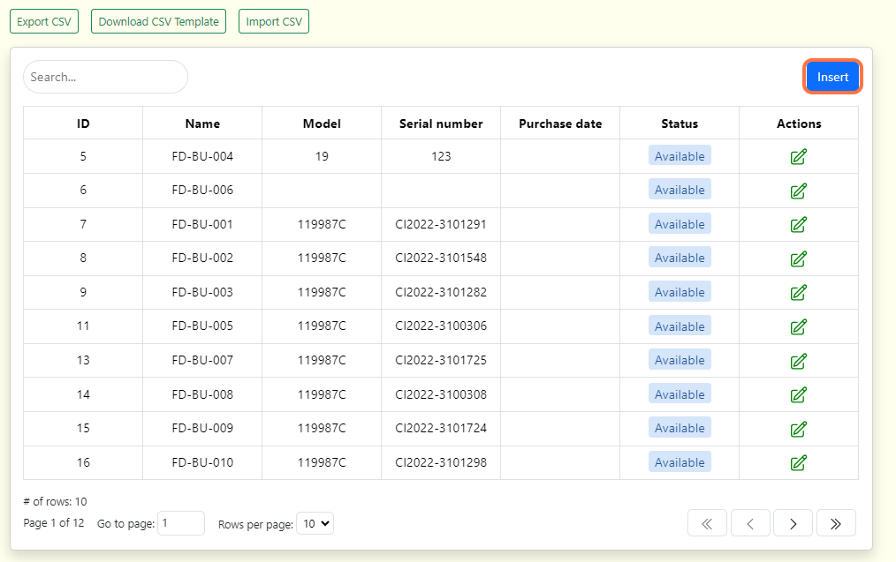
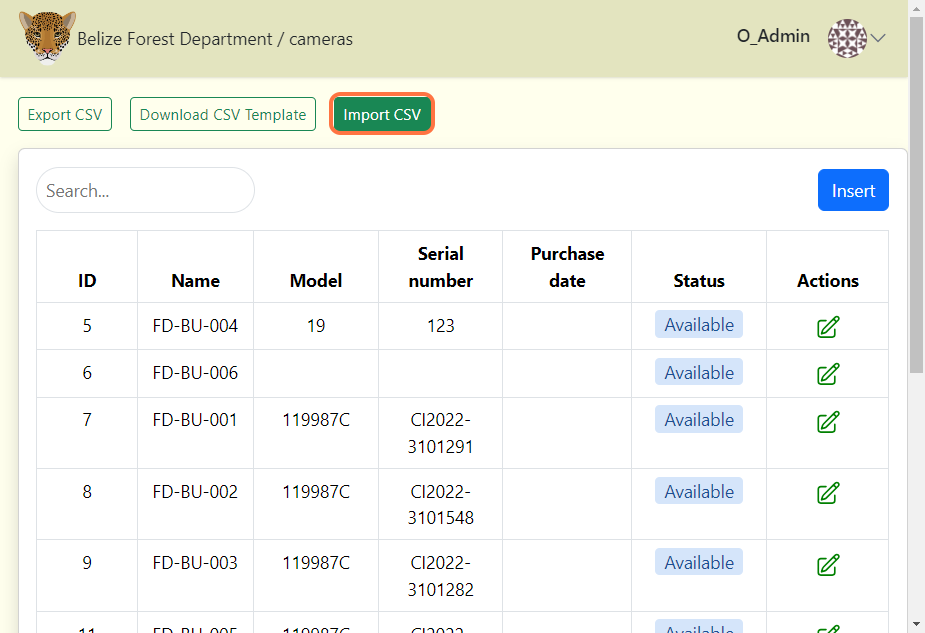
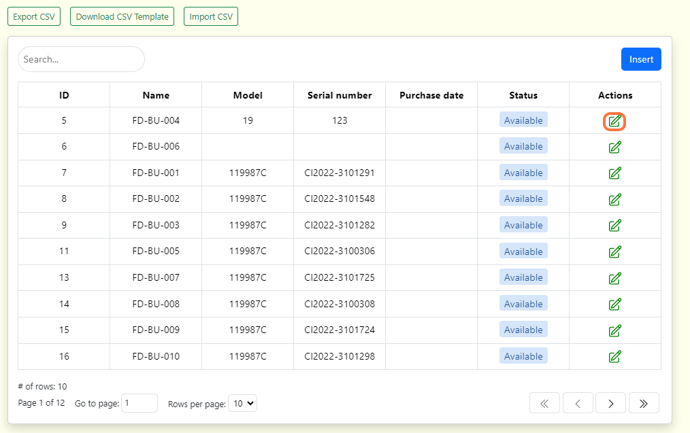

# Cameras

A camera is the physical device that is set out to capture images. Since organizations may use the same cameras across several different projects, camera details are managed at the Organization page. This means that a camera created within an organization can be connected to any camera check in any project in that organization.

## Create a camera in the Organization page

**To create a camera in the Organization page:**

**1.** Navigate to the Organization page, click on the "Organization details" button.

**2.** Then select "Cameras".

**3.** If there is no information displayed click on the blue "Add New Camera" button. If a table exists click the "Insert" button.

**4.** After clicking the "Insert" button, a form will appear.

 

**Fill out the "Add New Camera" form:** 

Required fields are marked with an asterik*
    
    - Camera name* - The unique name assigned to that specific camera. ***(Required)***

    - Make - The company which manufactured the camera (Example: Bushnell). ***(Optional)***

    - Model - The camera's specific model/code (Example: 119987C). ***(Optional)***

    - Serial number - The camera's given serial number. ***(Optional)***

    - Purchase date - The purchase date of the camera. ***(Optional)***

    - Purchase price - The purchase price of the camera. ***(Optional)***

    - Product URL - The link to where the camera can be found. ***(Optional)***

    - Number of batteries - The number of batteries needed for the camera. ***(Optional)***

    - Status* - The current status of the camera (Can either be: Active, Available, Lost, Retired, Stolen). ***(Required)***

    - Remarks - Additional notes about the product/camera. ***(Optional)***   

**5.** Click the blue "Create" button to finalize your changes.

<!-- Picture Here -->
  

## Uploading Data

You can also upload your cameras in bulk from a CSV file. Refer to Wild Eyes Batch upload guide for detailed instruction on how to format your CSV file. 

**To upload your CSV file:**

**1.** Click on the "Import CSV" button.

**2.** Select the CSV file that has the camera details.

**3.** Then click the "Submit import data" link that appears next to the "Import CSV" button to upload.

<!-- Picture Here -->

## Edit an existing camera

**To edit an existing camera:**

**1.** Click the green edit icon button to the right of any camera record. 

<!-- Picture Here -->

**2.** Once your edits have been made, click on Save Changes to save your edits.

