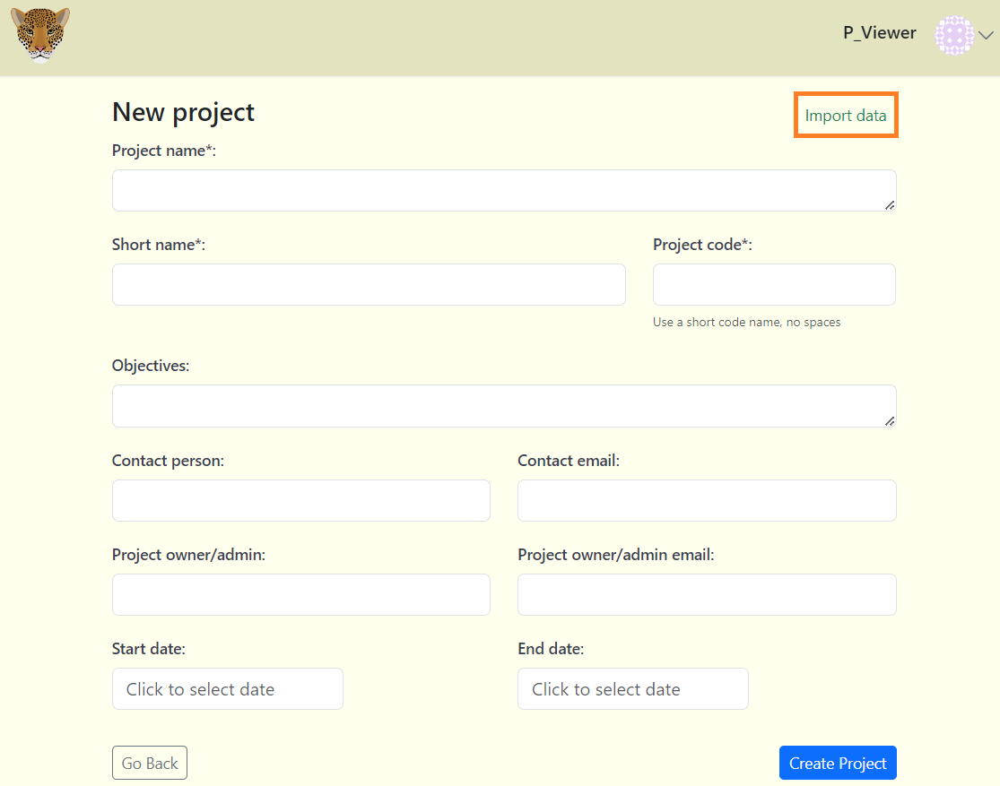

# Creating Projects

## Create a new project

**To create a new project:**

**1.** Navigate to the Organization page, click on the grey "New Projects" button which can be found under the Organization details button.

**2.** After clicking the "New Projects" button, a form will appear.

**Fill out the "New Project" form:**

Required fields are marked with an asterik*
    
    - Project name* - The name assigned to that specific project. ***(Required)***

    - Short name* - A shortened version of the project name. ***(Required)***

    - Project code* - An abbreviation or acronym to represent the project name (no spaces or special characters with the exception of a dash. For example: SIBUN-2024). ***(Required)***

    - Objectives - The outlined goals/tasks of the project. ***(Optional)***

    - Contact Person - The representative/first point of contact for the project. ***(Optional)***

    - Contact email - The primary email of the contact person. ***(Optional)***

    - Project owner/admin - The project creator/owner. ***(Optional)***

    - Project owner/admin email - The primary email of the project creator/owner. ***(Optional)***

    - Start date - The date of which the project was initialized. ***(Optional)***

    - End date - The appointed ending date of the project. ***(Optional)***

**3.** Click the blue "Create Project" button to finalize your changes.

**4.** After clicking the "Create Project" button. If there are no errors, you will be redirected to your project dashboard.

***Note:*** You can also import project data from your project CSV file by clicking the Import data button. The data from your CSV file will fill out the fields in the form. (Remember to check for correct CSV format).

