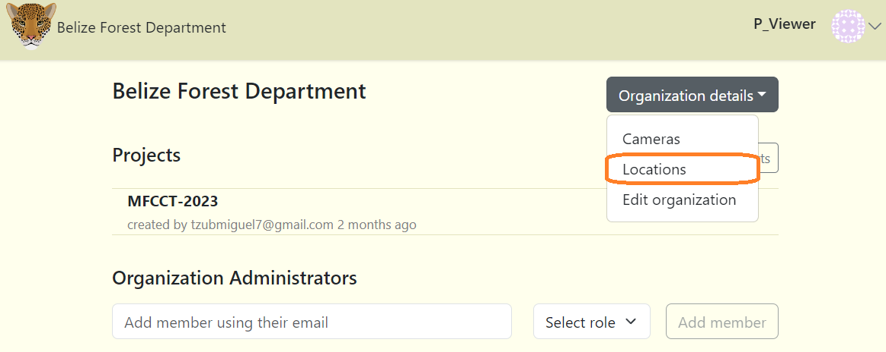
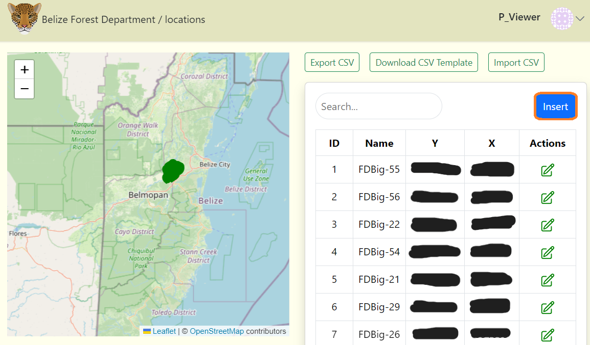
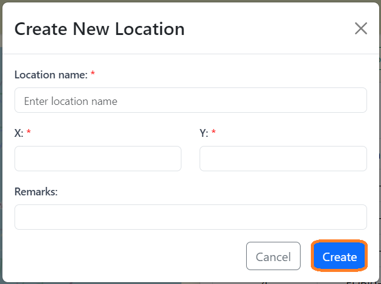
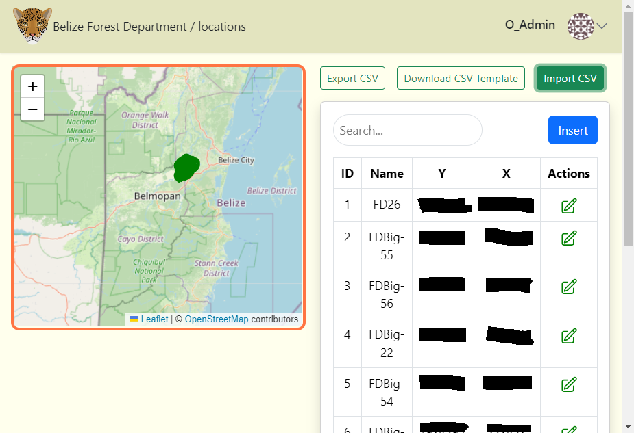
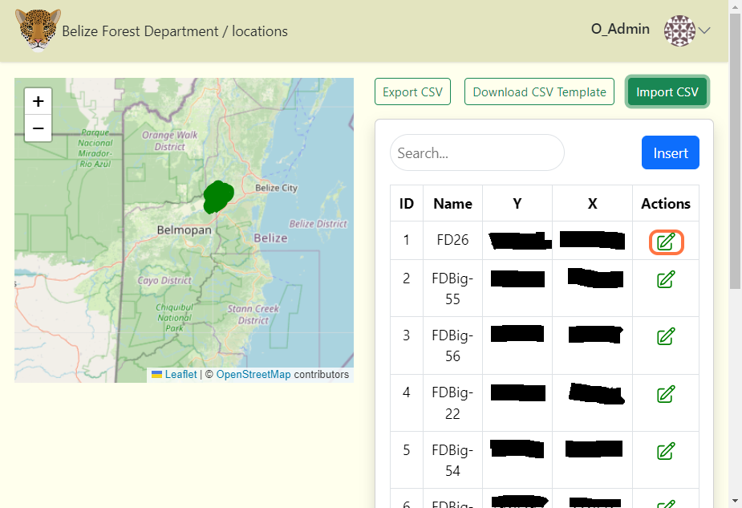
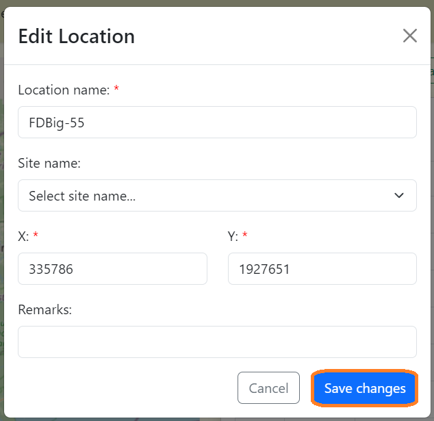

# Locations

A location is the physical position (latitude and longitude) of a camera trap device. For projects with multi-year sampling efforts, a location may be associated with multiple camera checks.

## Create a location in the Organization page

**To create a location in the Organization page:**

**1.** Navigate to the Organization page, click on the "Organization details" button.

**2.** Then select "Locations".

**3.** If there is no information displayed click on the blue "Add New Camera" button. If a table exists click the "Insert" button.

**4.** After clicking the "Insert" button, a form will appear.

**Fill out the "Create New Location" form:**

Required fields are marked with an asterik*
    
    - Location name* - The assigned location name. ***(Required)***

    - X* - The X coordinates for the location (Must be in UTM format). ***(Required)***

    - Y* - The Y coordinates for the location (Must be in UTM format). ***(Required)***

    - Remarks - Additional notes about the location. ***(Optional)***

**5.** Click the blue "Create" button to finalize your changes.

<!-- Picture Here -->

## View Location on map

- After entering your location data, it will be displayed in a table format and the coordinates of your location will be shown on a map. Zoom in to see specific locations, especially if the locations are clustered.

<!-- Picture Here -->

## Edit an existing location

**To edit an existing location:**

**1.** Click the green edit icon button to the right of any location record. 

**2.** Once your edits have been made, click on Save Changes to save your edits.

<!-- Picture Here -->
