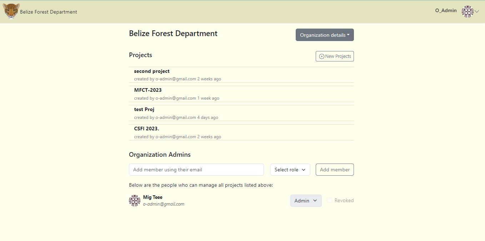
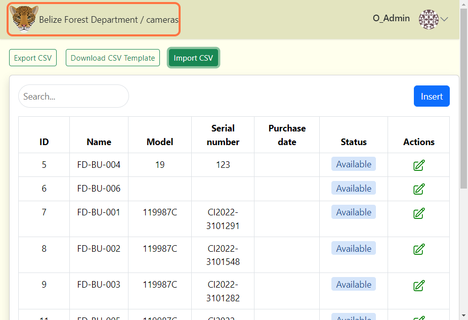

# Overview

## View Organization Page

**To navigate to the Organization page:**

**1.** Click on your organization's name under the Organizations section within the Home page. 

- The organization page lists all your projects. It also shows a list of organization admins only ***(roles include organization admin, organization editor, and organization viewer).***

<!-- Picture Here -->

## Organization Details  

**To access the Organization details menu:**

**1.** Click on the Organization details button to open the option to add cameras, locations and edit your organization information.

<!-- Picture Here -->

## Navigate to Home Page

**To quickly navigate to your Home page:**

**1.** Click on the logo located on the top right corner of the header. You can click on the organization name to navigate to the Organization page as well.

<!-- Picture Here -->
