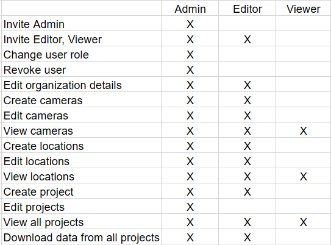
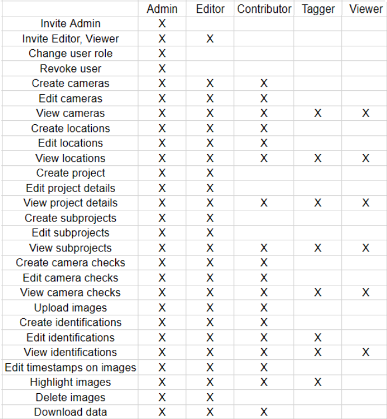

# Permission levels

## Organization permissions

**Organization-levels are made up of three different roles:**

- Organization admin
- Organization editor
- Organization viewer

***Note:*** Each role comes with different a level of access and permissions.

**Below is a table illustrating the access/permission levels of each specific role (if access is allowed it will be marked with an "X")**

## Project permissions

**Project-levels are made up of five different roles:**

- Project admin
- Project editor
- Project contributor
- Project tagger
- Project viewer

**Below is a table illustrating the access/permission levels of each specific role (if access is allowed it will be marked with an "X")**

## Inherited roles

**Below is a chart displaying the inheritance between each of the organization and project roles:**

