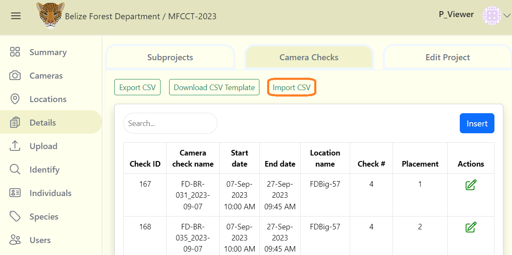

# Camera Checks 

A camera check is the placement of a camera at a location (latitude, longitude) during a specific period of time. There can be multiple camera checks associated with one location. 

## Create a Camera Check

***Note:*** Before creating a new camera check, you must enter all your camera, and location details prior. 

**Camera checks can be created similar to how you create camera or location details:**

***1.*** From your project dashboard, navigate to the "Details" tab and then click on the "Camera Checks" tab.

***2.*** If there is no data displayed click on the blue "Add New Camera" button. If a table exists click the "Insert" button.

***3.*** After clicking the "Insert" button, a form will appear.

**Fill out the "Create New Camera Check" form:**

Required fields are marked with an asterik*
    
    - Camera deployment name* - Automated camera name given by the system (Corresponds with the start date, can be adjusted by editing the start date). ***(Required)***

    - Start date* - The date of which the camera check was initialized. ***(Required)***

    - End date* - The predetermined ending date of the camera check's usage. ***(Required)***

    - Location* - The location where the camera check is being recorded from. ***(Required)***

    - Camera* - The assigned camera which the check will be performed on. ***(Required)***

    - Failure type* - The reason for the camera's failure/absence (Can either be: Camera Functioning, Camera Hardware Failure, Memory Card Failure, Unkown Failure, Vandalism, Theft, Wildlife Damage). ***(Required)***

    - Camera placement - The assigned placement of the cameras. ***(Optional)***

    - Check # - The number of check's that have been performed. ***(Optional)***

    - Setup person - The person who was assigned to setup the camera check. ***(Optional)***

    - Pickup person - The person who was assigned to picking up the camera check. ***(Optional)***

    - Subproject - Any subproject's which are related to the camera check. ***(Optional)***

    - Remarks - Additional notes about the camera check. ***(Optional)***

***4.*** Click the blue "Create" button to finalize your changes.

## Uploading Data

You can also upload your camera checks in bulk from a CSV file. Refer to Wild Eyes Batch upload guide for detailed instruction on how to format your CSV file. 

**To upload your data:**

***1.*** Click on the Import CSV button.

***2.*** Then select your CSV file containing the camera check data.

***3.*** Click on blue Submit import data link next to the Import CSV button.

<!-- Picture Here -->
  

## Edit an existing camera check

**To edit an existing camera check:**

***1.*** Click the green edit icon button to the right of any camera check record. 

***2.*** Once your edits have been made, click on Save Changes to save your edits.

<!-- Picture Here -->
