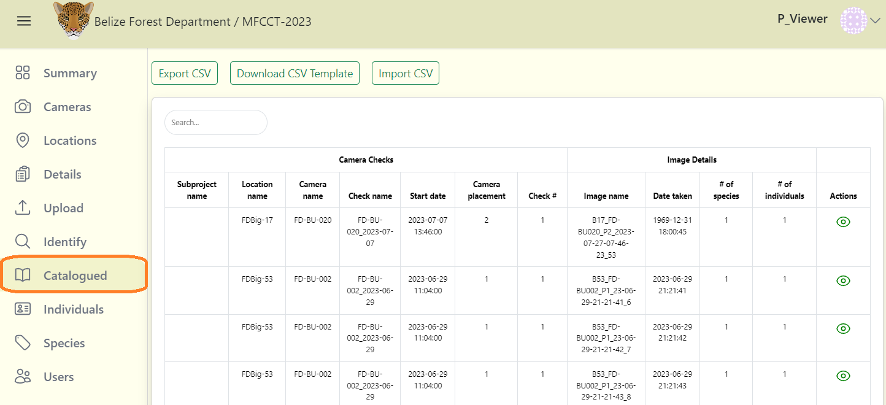
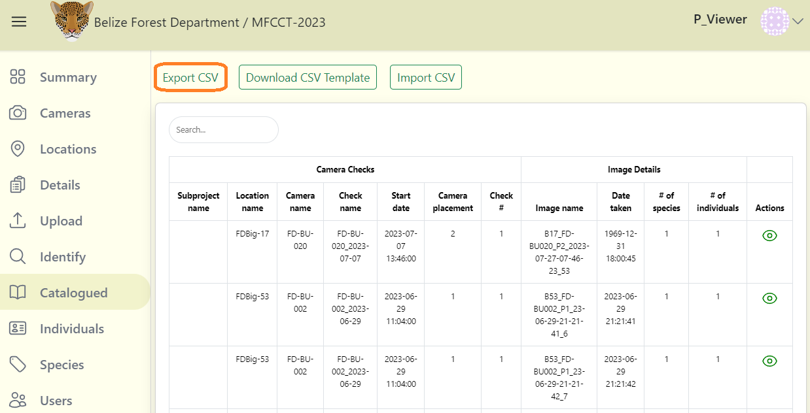
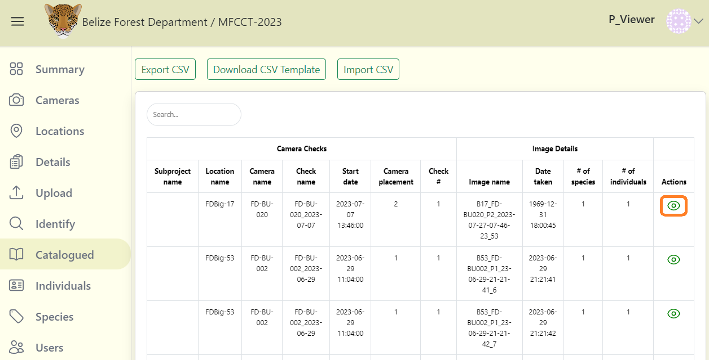
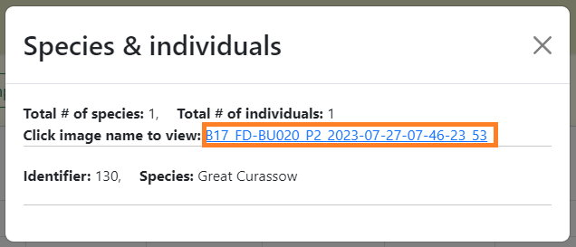
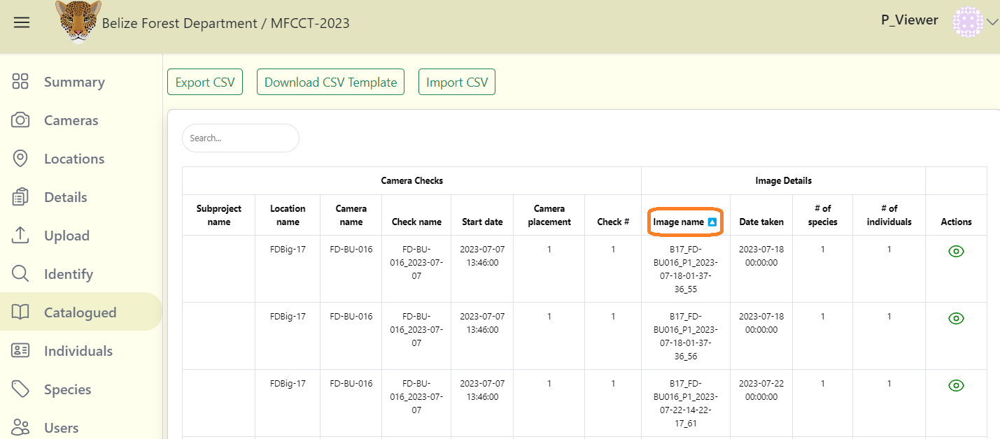
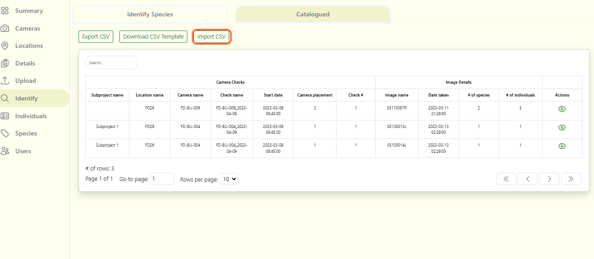

# Catalogued  

The catalogued tab displays identified images in table form.

## View Catalogued Data  

**To view catalogued data:**

**1.** Navigate to your project dashboard, then click on the Catalogued tab.

**2.** If catalogued data exists, a table will be displayed.

**3.** To download the table as CSV file, click on the Export CSV button.

**4.** Click on the green eye icon to view additional data in that record. 

**5.** It will display species and individuals identified in the image. It also provides a link to view the image.

**6.** You can sort the table by clicking on the column header. You will see a blue down or up arrow icon to indicate descending or ascending sort. To disable sorting, click on the header until the arrow icon disappears.

<!-- Picture Here -->  

## Bulk upload catalogued data

If images uploaded in the ***Identify*** page have already been identified, organize your data in a CSV file using the correct format. Please refer to the **[Wild Eyes Batch upload guide](https://drive.google.com/drive/folders/14IctEBIenhSC7duImD5uH_f575h3rMwO)** (image template) for detailed instruction on how to upload your image metadata. 

**To upload your data:**

**1.** Click on Import CSV button.

**2.** Select your file.

**3.** Click on the blue Submit import data link next to the Import CSV button.

**4.** If there are no errors, you should then be able to see a success notification and a table with your data will appear below. Review that your images are identified correctly, by navigating to the Identify Species tab.

***Note:*** Report any issues encountered.

<!-- Picture Here -->

