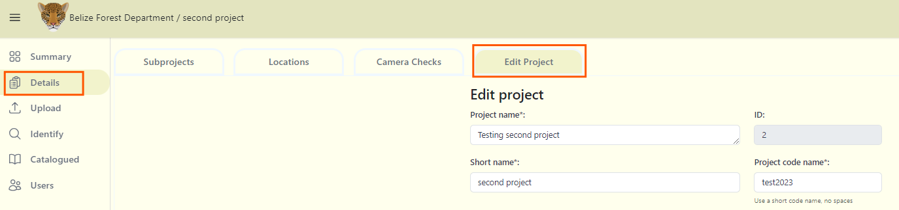

# Edit Project 

## Editing project details

**To edit your project details:**

***1.*** Navigate to your project dashboard, and click on the "Details" tab.

***2.*** Select the "Edit Project" tab.

***3.*** Once your edits have been made, click on Save Changes to save your edits.

<!-- Picture Here -->
