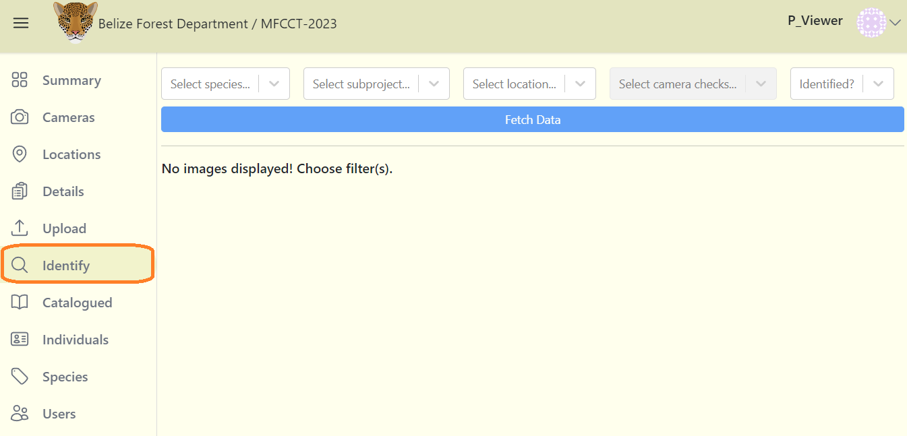
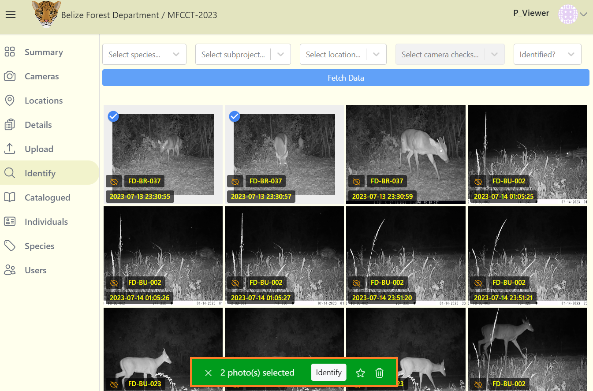
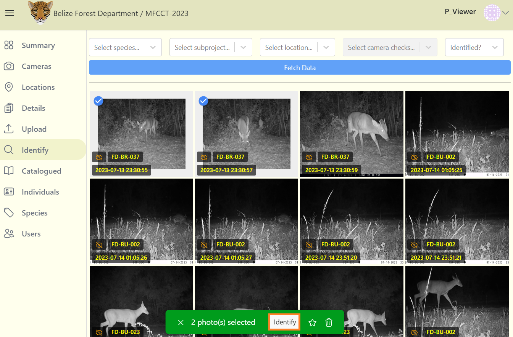
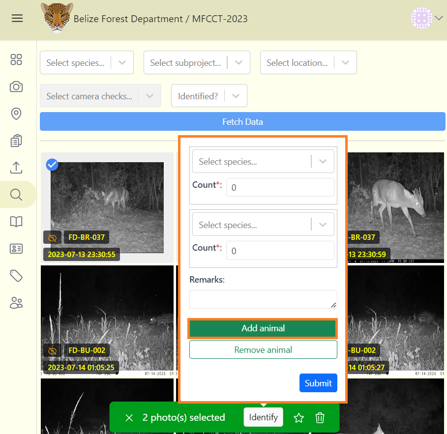
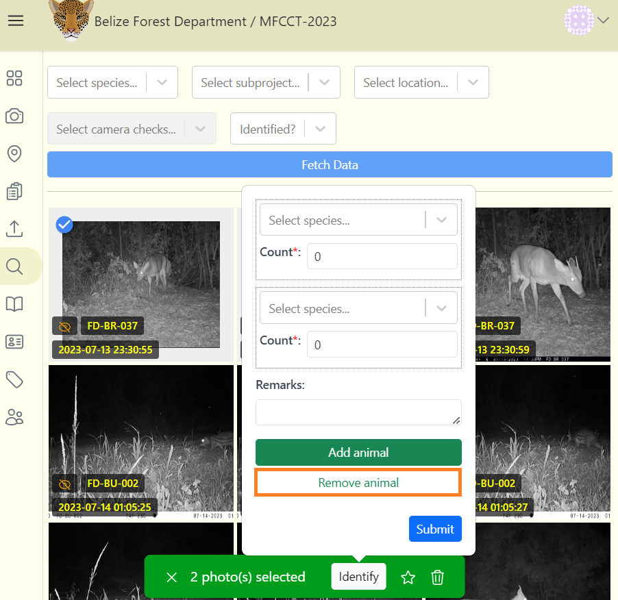
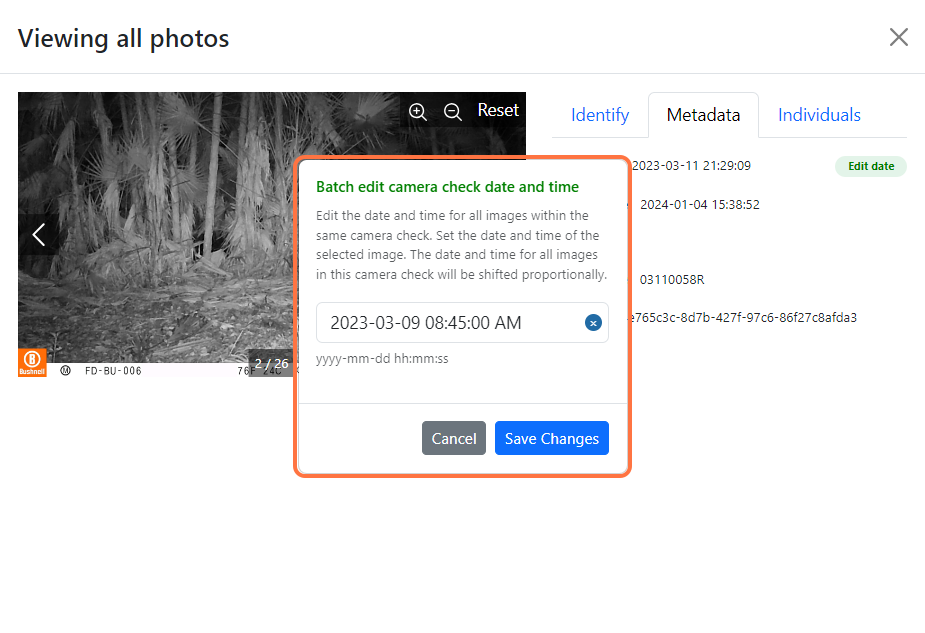

# Identify Images

**There are three ways to identify images:**

- Selecting multiple images.

- Selecting a single image.

- Importing catalogued data from a CSV file.

## Select filter options

**1.** Navigate to the Identify tab to access your project images.

**2.** At the top of the images is where you can filter your images. You can filter by species, subprojects, locations, camera check name. 

**3.** The "Camera check name" filter is enabled after selecting your location name. You can also filter identified or unidentified images. 

<!-- Picture Here --> 

**4.** After filtering your images click on the blue "Fetch Data" button to confirm your search.

## Identify multiple images 

**To select several images:**

**1.** Click on the circle check mark on the top left corner of the image. This will open a green floating menu at the bottom center of the screen. 

<!-- Picture Here -->
  

**2.** The green floating menu at the bottom center displays four additional actions which are available to you, this is called your action menu. The four actions shown are: Identify, highlight, delete and deselect.

    - Identify - The "Identify" button allows you to select any unidentified images and assign them to a specific species and number. 

    - Highlight - The star icon next to the "Identify" button will mark selected images as favorite.

    - Delete - The recycle bin icon next to the star icon will delete selected images. Exercise caution when deleting images (all image metadata, including the image will be permanently deleted).

    - Deselect - Click on the X icon to deselect all images.

***Note:*** If at least one identified image is among the selected images, the white Identify button will be disabled.  

<!-- Picture Here -->
  

**3.** After selecting the image(s) you want to identify (All selected images must be unidentified), click on the white "Identify" button. A species identification form will appear.

**Fill out the Identification form by selecting:**

Required fields are marked with an asterik*

    - *Select Species** - From the drop down menu, choose the species name of the identified images. ***(Required)***

    - *Count** - Enter the number of objects per species, in this case, it would be a deer and a count of 1. ***(Required)***

    - *Remarks* - Make note of any additional information. ***(Optional)***

***Note:*** The value entered in the "Count" field should be determined by the number of different animals or species in the image(s). For example, if there are two tigers in an image the count value will be 2.

**4.** Click on the blue "Submit" button to save the identifications of the selected images.

**5.** If you have selected more than one species of animal in your images, then click the green "Add animal" button to add another species.

***Note:*** For example, if there are two jaguars and one deer in your selected images, enter a count of 1 for the deer, and a count of 2 for the jaguar. 

**6.** If you would like to remove a species, click the "Remove Animal" button. 

**7.** Click on the blue "Submit" button to save your changes

## Identify/edit a single image

**To identify or edit a single image:**

**1.** Click anywhere on the image (don't click on the check mark).

**2.** On the left side, you can view your image. The left and right arrow on the side of the image allows you to view previous or next image. On the right side, is contains information about the current image. If the image is already identified, you can edit under the Identify tab, and click the Save changes button.

**3.** If the image is not yet identified, then fill out the species identification form under Identify tab. Then click the blue Submit button.

<!-- Picture Here -->

## Image MetaData 

**To view image metadata:**

**1.** Click on the Metadata tab. It displays the image time capture (Date taken), upload date, image name and ID. You can also edit the dates of images with a camera check.  

<!-- Picture Here -->
  

## Edit image date and time

**To edit dates within a camera check:** 

**1.** Click on the Metadata tab.

**2.** Click the green Edit Date button. A dialogue box will appear where you can enter the correct date and time of the image.

**3.** Remember to select the exact image to enter the correct start date and time. All other image dates and time within the same camera check will be shifted proportionally to the current image date and time.  

<!-- Picture Here -->
  

## Add individuals

**To add specific individual data, for example, identifying the sex, age and name of a jaguar:**

**1.** Click on the Individuals tab

**2.** Click on the green Add individual button.

**3.** Fill out the form. Required fields are marked with asterisks.

**4.** Click on the blue Submit button

**5.** Click on the X icon at the top right exit the window or click the right arrow on the image to move to the next image.

***Note:*** It is important that you enter data in the count field when identifying species. The number of count will determine how many individuals can be added.  

<!-- Picture Here -->

