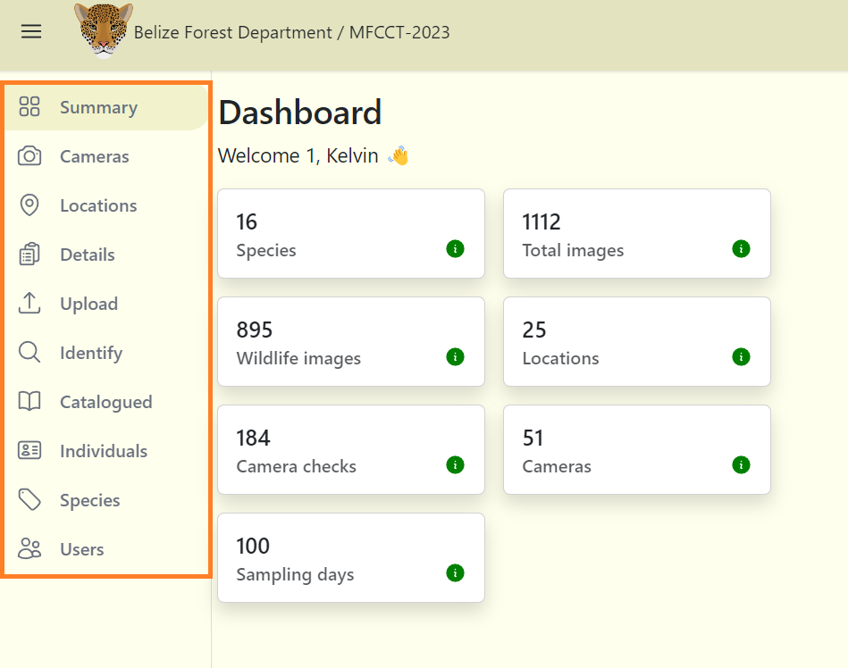

# Dashboard Overview

## Navigating

The project dashboard provides quicker access to many useful tools. However, before you can access your project dashboard, you must create a new project.

**To access your project dashboard:**

**1.** Once you have created (or been added to) a project, your project dashboard can be accessed through the organization page.

**2.** When entering the organization page, under the "Projects" section you will find the project(s) which you are currently apart of.

**3.** Click on the appropriate project to access your dashboard.

***Note:*** You can also access your project dashboard by clicking on your current project's name from the homepage.

  

## Contents  

**The project dashboard contains:**

- **Summary tab:** The project summary tab displays an overview of data within that project.

- **Cameras tab:** Here you'll find created cameras which can be connected to any camera checks within any project in that organization.

- **Locations tab:** This is where you will create, view, create or edit a location.

- **Details tab:** This is where you can set and edit project details including the objectives, start and end date. This is also where you can add and edit Subprojects and Camera Checks information (required fields).

- **Upload tab:** This is where you upload images belonging to the project. Images are uploaded per camera checks.

- **Identify tab:** Here you’ll see the images that have been uploaded from the "Upload tab". These images can be filterd by location, camera checks, species and subprojects. 

- **Catalogued Tab:** This is where all of the data that has been reviewed by a user will be stored in this section. Only data from the project you’re viewing will be shown here.

- **Individuals tab:** The individuals tab will contain images of known (recorded) individuals (jaguars, tapir and other identified individuals).

- **Species tab:** The species tab will contain a a list of different recorded species.

- **Users tab:** This button will open a screen where you can invite users to join your project.  

