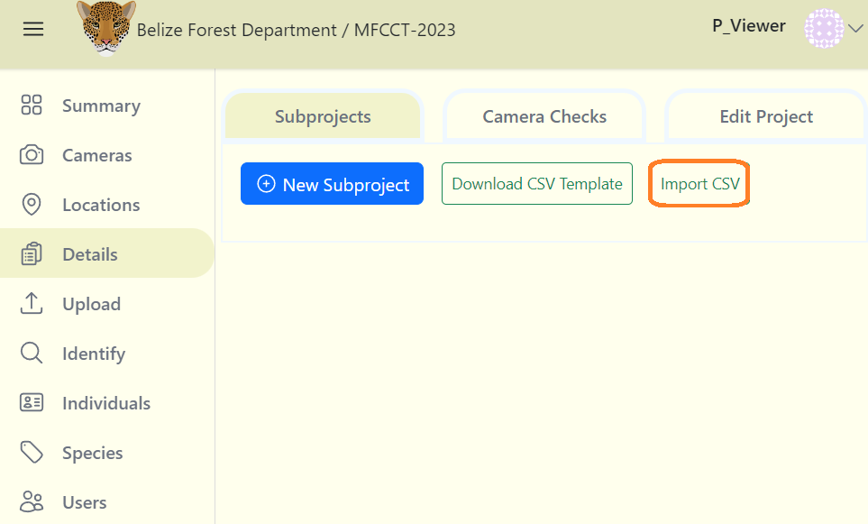

# Subprojects

A subproject is a grouping of camera checks. You can use subprojects to fit the way that your team works. They also help in breaking down the project into smaller, easier-to-manage tasks. 

## Create a Subproject

**A Subproject can be created similar to how you create camera or location details:**

**1.** From your project dashboard, navigate to the "Details" tab and then click on the "Subprojects" tab.

**2.** If there is no data displayed click on the blue "Add New Subproject" button. If a table exists click the "Insert" button.

**3.** After clicking the "Insert" button, a form will appear.

**Fill out the "Create New Subproject" form:**

Required fields are marked with an asterik*
    
    - Subproject* - The assigned name for the subproject. ***(Required)***

    - Description - A short paragaph describing the purpose of the subproject. ***(Optional)***

***4.*** Click the blue "Create" button to finalize your changes.

## Uploading your data

You can also upload your subprojects in bulk from a CSV file. Remember to follow the specific format or download the CSV template available on the screen.

**To upload your data:**

**1.** Click on the Import CSV button.

**2.** Then select your CSV file containing the subproject data.

**3.** Click on blue Submit import data link next to the Import CSV button.

<!-- Picture Here -->

## View camera checks within a sub-project

**To view all of the camera checks within a subproject:**

**1.** Navigate to the subprojects table in Details tab.

**2.** Click on the name of the subproject in the Subproject Name column.

**3.** A screen will open displaying the camera checks assigned to that subproject. You can filter, sort and search through camera checks in this table.

<!-- Picture Here -->
  

## Edit an existing Subproject

**To edit an existing Subproject:**

**1.** Click the green Edit button to the right of any sub-project record. 

**2.** Once your edits have been made, click on Save Changes to save your edits.

<!-- Picture Here -->
