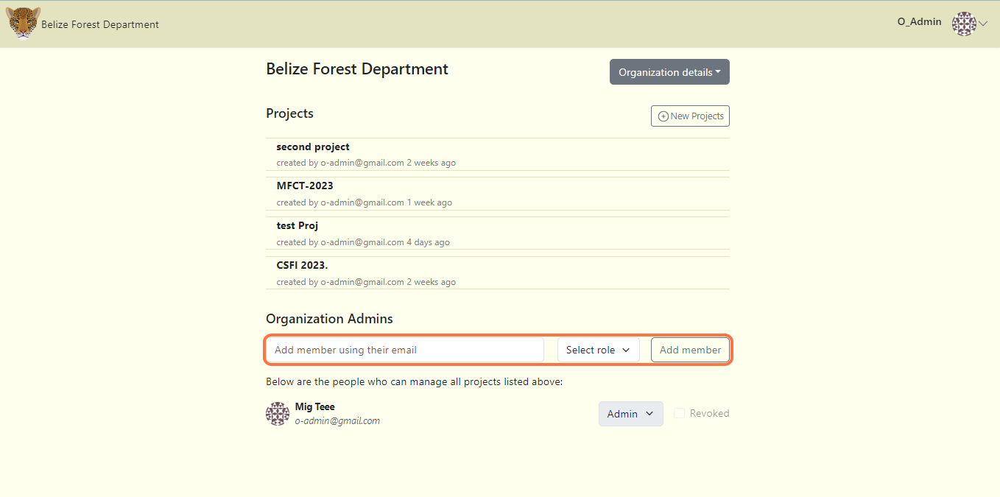
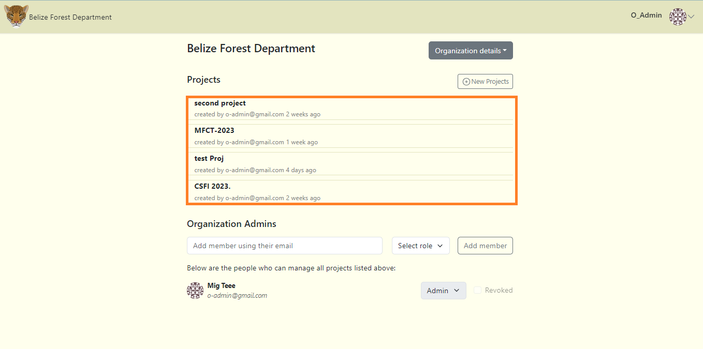
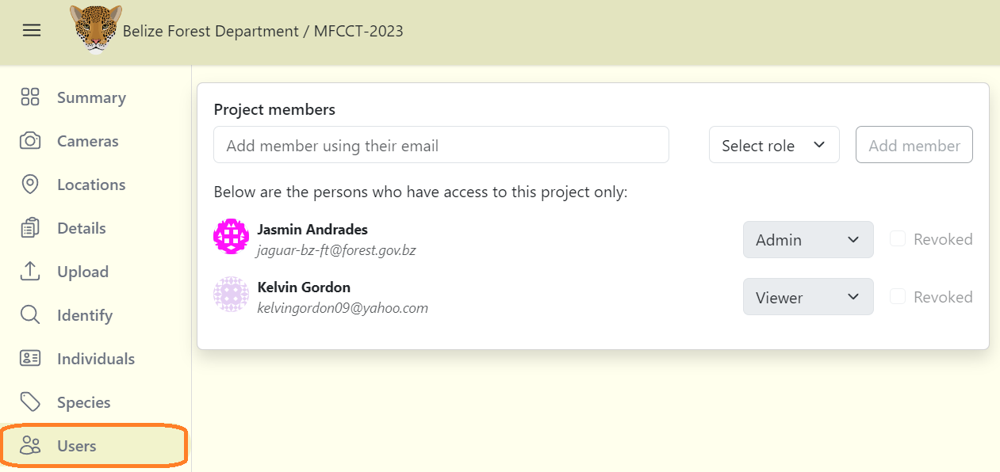
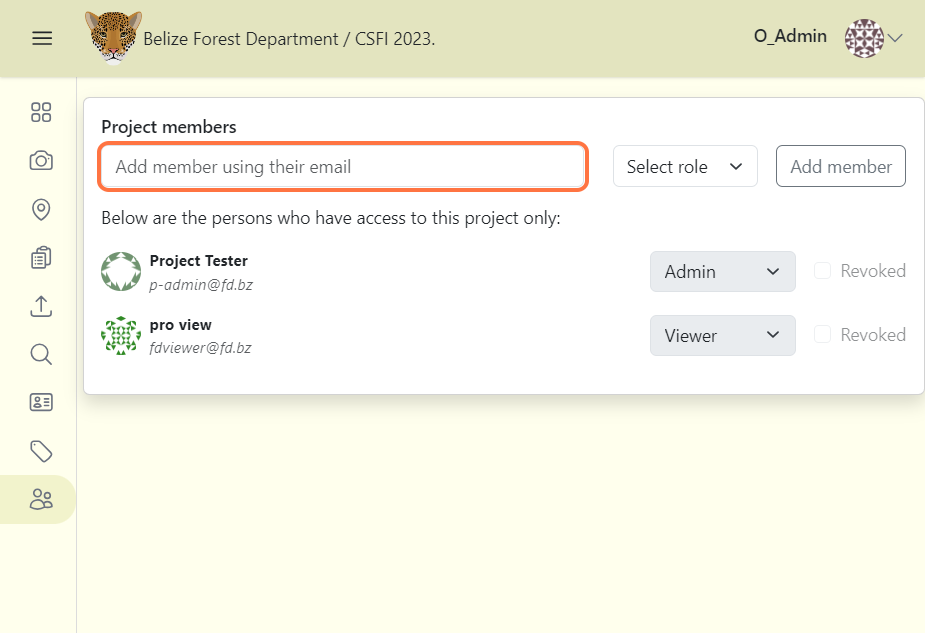
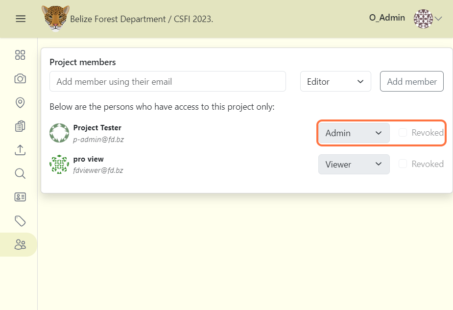

# Adding team members

## Organization-level members

Organization-level roles are made up of three roles. ***Organization admin***, ***Organization editor***, and ***Organization viewer***. Organization admins can access all project data. The Admin role can add members, change roles and revoke members. However, the Editor and Viewer roles cannot change roles or revoke users.

**To add organization-level roles to members:**

**1.** Navigate to the Organization page.

**2.** Scroll to the bottom.

**3.** Fill in the user's email (the user must sign up before adding them).

**4.** Select a role for the user.

**5.** Click the Add member button. The added user will be displayed below.

***Note:*** Organization-level members will have access to all projects within the organization.    

<!-- Picture Here -->
  

## Project-level members

Project-level roles are made up of ***five*** roles, ***Project admin***, ***project editor***, ***project contributor***, ***project tagger*** and ***project viewer***. Project viewer is the lowest-level role within project-level roles. 

**To add project-level roles to members:**

**1.** Navigate to the Organization page and select the project where you want to add members.

**2.** Click the "Users" tab on the project dashboard.

**3.** Fill in the user's email (the user must sign up before adding them).

**4.** Select a role for the user.

**5.** Click the Add member button. The added user will be displayed below.

***Note:*** Members added to a project will only have access to that particular project.  

<!-- Picture Here -->
  

## Change user roles or revoke users

Organization admin roles can change user roles for both organization-level and project-level members. Project admin can only change project-level roles. 

***To change roles:***

**1.** Locate the member from the list of added members.

**2.** Select the role to change. A notification will appear at the top center to notify successful change.

**3.** To revoke users, simply check the box next to Revoked. You can uncheck to unrevoked users.

***Note:*** revoke means that the user will not longer have access to the specific project. If you revoke organization-level members, they will no longer have access to the organization.  

<!-- Picture Here -->
